# it-ops-toolkit: project plan and architecture

This document describes how the toolkit is built, how each part works end to end, what happens
when something fails, and what is left to do. It describes the code on `main` at commit
`f4066c9` (2 October 2026). Anything not built is marked **planned**. For the user guide, see the
[README](README.md); for the reasons behind the main choices, see
[docs/decisions.md](docs/decisions.md).

## Contents

1. [Overview](#1-overview)
2. [Requirements](#2-requirements)
3. [Architecture](#3-architecture)
4. [Modules](#4-modules)
5. [End-to-end feature workflows](#5-end-to-end-feature-workflows)
6. [Cross-cutting concerns](#6-cross-cutting-concerns)
7. [Execution roadmap](#7-execution-roadmap)

## 1. Overview

### 1.1 Purpose and scope

The toolkit automates the repetitive work of first- and second-line IT support: creating
directory accounts for new starters, closing them for leavers, tracing account lockouts,
grading the health of a computer, and isolating network faults layer by layer. It has two
independent implementations of the same rules:

- a PowerShell module, `ItOpsToolkit`, for Windows PowerShell 5.1 and PowerShell 7, which works
  against Active Directory Domain Services (AD DS) through the `ActiveDirectory` module;
- Bash scripts in `linux/`, which work against a Samba Active Directory domain controller with
  `samba-tool` and the ldb tools, plus Linux health, network and Born2beRoot monitoring scripts.

A knowledge base (`docs/kb/`) and a troubleshooting method (`docs/method.md`) cover the manual
side of the same tickets.

In scope: command-line tools run by an operator or a scheduler, their configuration, tests and
documentation. Out of scope: a web interface, a service or daemon, a database of its own,
deleting accounts (left to a separate, reviewed process, see
[decision 8](docs/decisions.md#8-idempotent-onboarding-and-offboarding)), and mailbox or licence
provisioning.

There are no HTTP endpoints anywhere in the repository. The "APIs" in this document are the
PowerShell functions, the script command lines, the file formats and the external commands and
.NET classes the tools call.

### 1.2 Current status

Module version `0.1.0` (`src/ItOpsToolkit/ItOpsToolkit.psd1`). Merged to `main` through pull
request 1 on 2 October 2026.

| Area | Built | Pending |
| --- | --- | --- |
| PowerShell AD functions (`New-ItoUser`, `Remove-ItoUser`, `Get-ItoLockoutSource`) | Built; tested with Pester mocks only | A run against a real Windows Server domain (README, "Not run yet") |
| Bash onboarding and offboarding | Built; unit-tested with fake Samba tools and integration-tested against a real Samba AD DC (16 tests) | Kerberos authentication (roadmap) |
| Password handling | Built: CSPRNG passwords, CMS delivery, `SecureString` only | Module logging check on a real machine (README, "Not run yet") |
| `Get-ItoHealthReport` | Built; real sample from Windows PowerShell 5.1 | An elevated run to show BitLocker status |
| `health-report.sh`, `monitoring.sh` | Built; systemd, LVM and LUKS paths tested with fake commands only | A run on a systemd VM with LVM on LUKS |
| `Test-ItoNetwork`, `net-check.sh` | Built; `Test-ItoNetwork` has run in Windows PowerShell 5.1 on Windows 11 and in PowerShell 7.5 and 7.6 on Linux, `net-check.sh` in the Debian test container | A real `Test-ItoNetwork` run in PowerShell 7 on Windows and on macOS |
| CI (`.github/workflows/ci.yml`) | Built, and has run on GitHub: the push runs [37035216224](https://github.com/fasharif/it-ops-toolkit/actions/runs/37035216224) and [37038276429](https://github.com/fasharif/it-ops-toolkit/actions/runs/37038276429) on 2 October 2026 passed all six jobs; in both, Pester in PowerShell 7.6.6 on `windows-latest` reported 217 passed, 1 skipped and 87.9% command coverage | The README still says the workflow has not run; it needs updating |
| Test image | `tests/docker/Dockerfile` target `powershell` now starts from `ubuntu:25.10` (Dependabot, pull request 2) | The Dockerfile comments, `scripts/test-powershell.sh`, `scripts/make-samples.sh` and the README "Running the tests" table still describe the image as Ubuntu 24.04; 25.10 is an interim release (D1 in 7.2) |
| Knowledge base and method | Built: ten articles, method, priority matrix, ticket template | None |
| Roadmap features | None | `-Disabled` accounts until the start date, Kerberos for the Bash scripts, Pester 6, PowerShell Gallery |

### 1.3 Tech stack

| Layer | Technology | Version where pinned | Why chosen |
| --- | --- | --- | --- |
| Windows automation | PowerShell module of advanced functions (`ItOpsToolkit`) | Module 0.1.0; `PowerShellVersion = '5.1'`; `CompatiblePSEditions` Desktop and Core | What Windows help desks already run; comment-based help, parameter validation and `-WhatIf`/`-Confirm` come with the language |
| Directory access (Windows) | `ActiveDirectory` module (RSAT), which talks to AD Web Services | Not pinned (part of Windows) | The supported way to manage AD DS from PowerShell |
| Linux automation | Bash with `set -euo pipefail` | Not pinned | Present on every Samba administration host; no extra runtime |
| Directory access (Linux) | `samba-tool`, `ldbsearch`, `ldbadd`, `ldbmodify` | Debian 13 packages, not pinned; the last recorded run used Samba 4.22.11 | Samba's own tools; they read credentials from an authentication file and sign and seal LDAP sessions |
| JSON on Linux | `jq` (`linux/lib/config-check.jq`) | Debian package, not pinned | The same configuration rules as PowerShell without a second language runtime |
| CSV on Linux | Python 3 standard library (`linux/lib/hrfeed.py`) | `target-version = "py310"` in `pyproject.toml`; linted in `python:3.13-slim` | Bash has no reliable CSV parser, and `samba-tool` already needs Python ([decision 7](docs/decisions.md#7-a-small-python-helper-for-csv-parsing)) |
| Password encryption | CMS (PKCS #7) with AES-256: .NET `EnvelopedCms`, `openssl cms` | Not pinned | Standard format that both `Unprotect-CmsMessage` and `openssl cms` read ([decision 3](docs/decisions.md#3-initial-passwords-only-leave-the-tool-encrypted)) |
| Network probes (PowerShell) | .NET `System.Net` classes | Not pinned | One code path on Windows and Linux, testable without Windows-only cmdlets ([decision 6](docs/decisions.md#6-net-networking-classes-for-test-itonetwork)) |
| Network probes (Linux) | `ip`, `getent`, Bash `/dev/tcp`, `curl`, `ping`, `traceroute` or `tracepath` | Not pinned | Standard tools; optional ones are skipped when missing |
| Reports | Self-contained HTML (no scripts), JSON, text; CSV for summaries and audits | Not applicable | Readable by people and by other tools |
| PowerShell tests and lint | Pester, PSScriptAnalyzer | Pester 5.9.1, PSScriptAnalyzer 1.25.0, both pinned with SHA-256 in `scripts/Invoke-Tests.ps1` | Pester mocks stand in for the AD module, which Samba cannot serve ([decision 2](docs/decisions.md#2-mocked-active-directory-for-the-powershell-module-a-real-samba-dc-for-the-bash-scripts)) |
| Bash tests and lint | bats-core, bats-support, bats-assert, shellcheck | bats-core 1.14.0, bats-support 0.3.0, bats-assert 2.2.4 (tag and SHA-256 in `tests/docker/Dockerfile`); shellcheck image `koalaman/shellcheck:v0.11.0` | Unit tests with fake commands on `PATH` |
| Python lint | ruff, mypy `--strict` | ruff 0.16.9, mypy 2.3.1, hash-locked in `requirements-dev.txt` | One linter per language, all clean |
| Integration tests | Samba AD DC and client in Docker Compose (`tests/integration/compose.yaml`) | `debian:trixie-slim` pinned by digest | A real directory for the Bash scripts |
| PowerShell test image | `tests/docker/Dockerfile`, target `powershell` | `ubuntu:25.10` by digest; PowerShell 7.6.6 `.deb` pinned by version and SHA-256 | Microsoft's own image had no 7.6 tag ([decision 11](docs/decisions.md#11-pinned-tools-updated-deliberately)) |
| CI | GitHub Actions | `actions/checkout@v7`, `actions/upload-artifact@v7`, actionlint `rhysd/actionlint:1.7.12` | Runs the same scripts as a developer, plus Windows runners |
| Dependency updates | Dependabot (`.github/dependabot.yml`) | Weekly: GitHub Actions, Docker base images in `tests/docker`, pip | Pester, PSScriptAnalyzer, bats and PowerShell versions are updated by hand |

### 1.4 System components

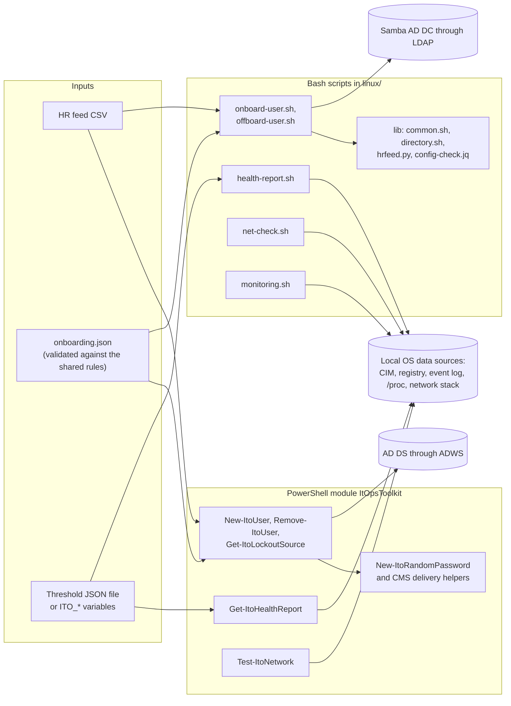

### 1.5 High-level data flow

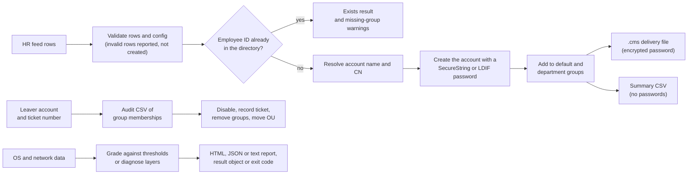

## 2. Requirements

Status: **Built** (code and tests exist), **Partly built** (part of the requirement exists;
none at present), **Planned** (not built). "Evidence" says how far it has been verified; where
it says "Pester mocks only", the code is built but has not yet run against the real system.

### 2.1 Functional requirements

| ID | Requirement | Module(s) | Status | Evidence |
| --- | --- | --- | --- | --- |
| FR-1 | Create directory accounts from an HR feed CSV, mapping each department to an OU and groups from one JSON file | 4.1, 4.4, 4.10 | Built | Samba: integration tests; AD: Pester mocks only |
| FR-2 | Generate a unique `sAMAccountName` (`first.last` or `flast`, at most 20 characters, numbered on collision, unique across every object class and within the batch) | 4.1, 4.2, 4.4, 4.10 | Built | Shared fixture `tests/fixtures/account-names.csv`; integration test creates `sara.ali` and `sara.ali2` |
| FR-3 | Build account names from an optional Latin spelling (`GivenNameLatin`, `SurnameLatin`) and reduce accented Latin names to ASCII | 4.1, 4.9 | Built | `tests/fixtures/feed-rows.csv`; integration test with an Arabic display name |
| FR-4 | Set a strong random initial password and "must change password at next logon" | 4.3, 4.4, 4.10 | Built | Integration test signs in and gets `NT_STATUS_PASSWORD_MUST_CHANGE` |
| FR-5 | Deliver the initial password only as a CMS-encrypted file (or, in PowerShell, a `SecureString` on the result) | 4.3, 4.4, 4.10 | Built | Pester `ParameterBinding` trace test; bats and integration tests; module logging itself not yet checked on a real machine |
| FR-6 | Preview every change (`-WhatIf`, `--dry-run`) | 4.4, 4.5, 4.7, 4.10, 4.11 | Built | Pester and bats dry-run tests |
| FR-7 | Rerunning a feed is safe: rows whose employee ID has an account are skipped, and missing configured groups are reported, not added | 4.4, 4.10 | Built | Pester, bats and integration tests |
| FR-8 | Write a summary CSV without passwords | 4.4, 4.10 | Built | Pester and bats tests |
| FR-9 | Offboard a leaver: export group memberships first, disable, record the ticket in the description, remove groups, move to the disabled users OU; never delete | 4.5, 4.11 | Built | Samba: integration tests; AD: Pester mocks only |
| FR-10 | Offboarding is idempotent; declined prompts give `Partial` or `Declined` (PowerShell) | 4.5, 4.11 | Built | Pester prompt tests; integration rerun test |
| FR-11 | Show whether an account is locked out and which computers caused it (event 4740 on the PDC emulator) | 4.6 | Built | Pester mocks only |
| FR-12 | Grade a Windows computer's health (eight areas) against thresholds and write HTML and JSON | 4.7 | Built | Pester; real sample in `docs/samples` |
| FR-13 | Grade a Linux machine's health (eight checks) as text, JSON or HTML with Nagios-style exit codes | 4.12 | Built | bats; systemd, LVM and LUKS paths with fakes only |
| FR-14 | Check the network layer by layer and name the lowest failing layer in plain language, on Windows and Linux | 4.8, 4.13 | Built | Pester, bats, real samples |
| FR-15 | Print the Born2beRoot system summary and broadcast it with `wall` | 4.14 | Built | bats; LVM path with fakes only |
| FR-16 | Configurable health thresholds (JSON file on Windows, environment variables on Linux) | 4.7, 4.12 | Built | Pester and bats threshold tests |
| FR-17 | Validate the shared configuration identically on both platforms and reject unknown settings | 4.1 | Built | Shared fixture `tests/fixtures/invalid-configs.tsv` |
| FR-18 | Generate a reset password as a `SecureString` for password reset tickets | 4.3, 4.15 | Built | Pester; KB 02 uses it |
| FR-19 | Knowledge base articles and a troubleshooting method that point to the scripts | 4.15 | Built | `docs/kb/`, `docs/method.md` |
| FR-20 | Option to create accounts disabled until the start date | 4.4, 4.10 | Planned | README roadmap; [decision 13](docs/decisions.md#13-new-accounts-are-enabled-when-they-are-created-before-the-start-date) |
| FR-21 | Kerberos authentication for the Bash directory scripts | 4.9, 4.10, 4.11 | Planned | README roadmap |
| FR-22 | Publish the module to the PowerShell Gallery | 4.2 | Planned | README roadmap |

### 2.2 Non-functional requirements

| ID | Requirement | Module(s) | Status | Evidence |
| --- | --- | --- | --- | --- |
| NFR-1 | Runs in Windows PowerShell 5.1 and PowerShell 7 | 4.2 to 4.8 | Built | ASCII-only source test; PSScriptAnalyzer `PSUseCompatibleSyntax` for 5.1 and 7.4; Pester in 5.1 and 7.6.6 on Windows in CI ([decision 9](docs/decisions.md#9-windows-powershell-51-compatibility-is-tested-not-assumed)) |
| NFR-2 | Passwords never on a command line, in output, logs, summaries or transcripts; directory credentials only from a mode-600 file | 4.3, 4.4, 4.9, 4.10 | Built | Pester transcript and binding-trace tests; bats and integration tests |
| NFR-3 | Every PowerShell function that changes state supports `-WhatIf`/`-Confirm`; `Remove-ItoUser` prompts by default (`ConfirmImpact = 'High'`) | 4.4, 4.5, 4.7 | Built | `tests/powershell/Module.Tests.ps1`, "Safety switches" |
| NFR-4 | One bad row or one failing data source does not stop the batch or the report | 4.4, 4.7, 4.10, 4.12 | Built | Pester and bats tests |
| NFR-5 | Pester command coverage of `src/ItOpsToolkit` at least 80% | 4.16 | Built | `-MinimumCoverage 80` in CI; last runs 87.9% to 88.3% |
| NFR-6 | No findings from PSScriptAnalyzer, shellcheck, ruff, mypy `--strict` and actionlint | 4.16 | Built | README results table; CI |
| NFR-7 | Reproducible test tooling: versions and hashes pinned | 4.16 | Built | [Decision 11](docs/decisions.md#11-pinned-tools-updated-deliberately); see 1.2 for the base image drift |
| NFR-8 | Output reads the same on every locale (invariant culture, UTC timestamps) | 4.7, 4.8, 4.12 | Built | `Format-ItoInvariant`; `date -u` |
| NFR-9 | Exit codes a scheduler or monitoring system understands | 4.9 to 4.14 | Built | [Decision 10](docs/decisions.md#10-exit-codes-that-monitoring-systems-understand) |
| NFR-10 | Read-only tools change nothing (`Get-ItoLockoutSource`, `Test-ItoNetwork`, `net-check.sh`, `monitoring.sh`) | 4.6, 4.8, 4.13, 4.14 | Built | Code review; no write calls |
| NFR-11 | One domain controller per run, so later steps see accounts created earlier | 4.2, 4.4, 4.5 | Built | Pester tests; [decision 14](docs/decisions.md#14-one-domain-controller-for-a-whole-run) |
| NFR-12 | Untrusted text (event messages, service names, names from the feed) cannot break the HTML, JSON, LDIF or LDAP filters | 4.1, 4.7, 4.9, 4.12, 4.13 | Built | HTML-encoding, JSON-escaping, LDIF and LDAP-escaping tests |

## 3. Architecture

### 3.1 Architectural style

- **Command-line tools, no server.** Every part is a function or script that an operator or a
  scheduler runs, reads its input, talks to the system it manages and returns structured
  results. Nothing listens on a port and nothing keeps state between runs except the files it
  writes and the directory itself.
- **One rule set, two implementations.** The PowerShell module and the Bash scripts implement
  the same configuration, feed and naming rules independently, and three shared fixture files
  run in both test suites so the implementations cannot drift unnoticed
  ([decision 1](docs/decisions.md#1-one-configuration-file-for-windows-and-linux-onboarding)).
- **Thin adapters, pure core.** Calls to the outside world are kept in small wrappers that
  return plain objects (`src/ItOpsToolkit/Private/HealthCollectors.ps1`,
  `src/ItOpsToolkit/Private/NetworkProbes.ps1`, `linux/lib/directory.sh`), and the grading and
  diagnosis logic is pure (`src/ItOpsToolkit/Private/HealthChecks.ps1` describes itself as "data
  in, check objects out"; `Get-ItoNetworkDiagnosis`). Tests mock or fake the adapters and
  exercise the core directly.
- **Batch with per-item isolation.** Onboarding processes each row in its own `try`/`catch` or
  status branch and reports a status per row; health collectors each run in their own
  `try`/`catch`.
- **Idempotent, state-checking steps.** Each change checks the current state first, so a rerun
  finishes interrupted work or reports that nothing was needed
  ([decision 8](docs/decisions.md#8-idempotent-onboarding-and-offboarding)).

### 3.2 Layers and boundaries

| Layer | PowerShell | Bash | Responsibility |
| --- | --- | --- | --- |
| Interface | Public functions in `src/ItOpsToolkit/Public/` with parameter attributes | Option parsing at the top of each script; `usage()` | Accept and validate arguments; show help |
| Validation | `Read-ItoOnboardingConfig`, `Test-ItoOnboardingRecord`, `Read-ItoHealthThreshold`, `Assert-ItoDeliveryCertificate` | `config-check.jq`, `hrfeed.py`, threshold checks in `health-report.sh` | Reject bad input before any change |
| Orchestration | `process` blocks of the public functions | Main loop of each script | Order the steps, record status per row or step |
| Pure logic | `src/ItOpsToolkit/Private/NameHelpers.ps1`, `src/ItOpsToolkit/Private/HealthChecks.ps1`, `src/ItOpsToolkit/Private/NetworkDiagnosis.ps1` | `sam_candidate`, `grade`, `diagnose` | Decide names, grades and diagnoses |
| Adapters | `ActiveDirectory` cmdlets, CIM, registry, `Get-WinEvent`, .NET `System.Net`, `EnvelopedCms` | `ldbsearch`, `ldbadd`, `ldbmodify`, `samba-tool`, `openssl`, `ip`, `getent`, `curl`, `/proc` | Talk to the outside world |
| Output | Typed result objects (`ItOpsToolkit.*`), CSV, HTML, JSON, `.cms` files | Text tables, CSV, HTML, JSON, `.cms` files, exit codes | Report results |

Trust boundaries:

| Input | Trust | Handling |
| --- | --- | --- |
| HR feed CSV | Untrusted (comes from another system) | Every field validated; names limited to letters, combining marks, spaces, `.`, `-`, the apostrophe and the typographic apostrophe (U+2019); values escaped in LDAP filters and LDIF |
| `onboarding.json` | Operator-controlled | Validated against the shared rules; unknown settings rejected |
| Directory answers | Trusted source, parsed defensively | LDIF parsed with folded lines and base64 values (`ldif_values`) |
| Event messages, service names, host names | Untrusted text | HTML-encoded (`ConvertTo-ItoHtmlText`, `html_escape`) and JSON-escaped (`json_escape`) |
| Tool error output | May echo an LDIF line | `last_error` in `onboard-user.sh` drops any line containing `unicodePwd` |

### 3.3 Runtime and deployment topology

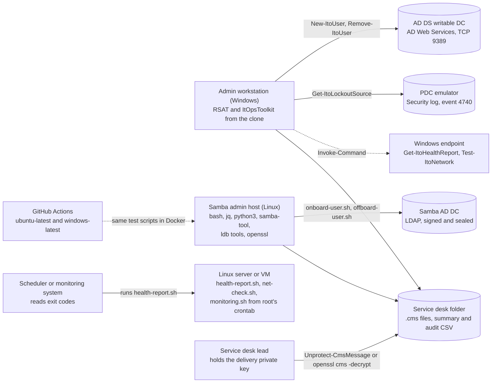

Nothing is installed as a service. The module is imported from a clone
(`Import-Module .\src\ItOpsToolkit\ItOpsToolkit.psd1`); the Bash scripts run from a clone or a
copy that keeps `linux/lib/` next to them. `monitoring.sh` is meant for root's crontab
(`*/10 * * * * /usr/local/sbin/monitoring.sh`, from the script's header). The dashed CI edge
means CI runs the same scripts in containers, not that it deploys anything.

### 3.4 Key design decisions

The full records are in [docs/decisions.md](docs/decisions.md). Summary:

| # | Decision | Consequence for this plan |
| --- | --- | --- |
| [1](docs/decisions.md#1-one-configuration-file-for-windows-and-linux-onboarding) | One JSON configuration for both platforms, validated case-sensitively on both | Validation exists twice; shared fixture `invalid-configs.tsv` |
| [2](docs/decisions.md#2-mocked-active-directory-for-the-powershell-module-a-real-samba-dc-for-the-bash-scripts) | Pester mocks for the AD module; real Samba DC for Bash | AD functions not yet run against Windows Server (roadmap item) |
| [3](docs/decisions.md#3-initial-passwords-only-leave-the-tool-encrypted) | Initial passwords leave only as CMS files or `SecureString` | `EnvelopedCms` instead of `Protect-CmsMessage`; module logging check pending |
| [4](docs/decisions.md#4-create-samba-accounts-with-one-ldbadd-with-the-password-on-standard-input) | One atomic `ldbadd`, password on standard input | No half-created Samba accounts |
| [5](docs/decisions.md#5-an-unprivileged-samba-dc-for-tests-with-xattr_tdb) | Unprivileged test DC with `xattr_tdb` | Test fixture only |
| [6](docs/decisions.md#6-net-networking-classes-for-test-itonetwork) | .NET networking for `Test-ItoNetwork` | One code path; PowerShell 7 on Windows and macOS real runs pending |
| [7](docs/decisions.md#7-a-small-python-helper-for-csv-parsing) | Python helper for CSV on Linux | Row rules exist twice; shared fixture `feed-rows.csv` |
| [8](docs/decisions.md#8-idempotent-onboarding-and-offboarding) | Idempotent onboarding and offboarding; never delete | Reruns report `Exists` or `AlreadyOffboarded` |
| [9](docs/decisions.md#9-windows-powershell-51-compatibility-is-tested-not-assumed) | 5.1 compatibility tested | Three tests skipped on 5.1 |
| [10](docs/decisions.md#10-exit-codes-that-monitoring-systems-understand) | Nagios-style exit codes; 64 for usage errors | See 5.7 for one gap |
| [11](docs/decisions.md#11-pinned-tools-updated-deliberately) | Pinned tools, updated deliberately | Pester 6 move needs a decision |
| [12](docs/decisions.md#12-real-sample-output-with-host-details-removed) | Real sample output with host details removed | New samples follow the same rule |
| [13](docs/decisions.md#13-new-accounts-are-enabled-when-they-are-created-before-the-start-date) | Accounts enabled at creation | `-Disabled` option planned |
| [14](docs/decisions.md#14-one-domain-controller-for-a-whole-run) | One domain controller per run | Run fails before any change when none is found |
| [15](docs/decisions.md#15-names-in-arabic-and-other-scripts-need-a-latin-spelling-from-hr) | Latin spelling from HR, no automatic transliteration of non-Latin scripts | `Invalid` rows name the column to fill in |
| [16](docs/decisions.md#16-which-stopped-services-the-health-report-counts) | Which stopped services count | Essential and ignored lists in the threshold file |

## 4. Modules

Sixteen modules, each with the same fifteen headings. Paths are relative to the repository
root.

### 4.1 Shared contracts: configuration, HR feed and account-name rules

#### Purpose

The rules both toolkits must apply identically: the onboarding configuration, the HR feed
columns and row checks, and the account-name algorithm.

#### Requirements

FR-1, FR-2, FR-3, FR-17; NFR-12.

#### Architecture

A written contract with two implementations, held together by shared fixtures:

| Rule | Contract | PowerShell | Bash and Python | Shared fixture |
| --- | --- | --- | --- | --- |
| Configuration | `config/onboarding.schema.json` | `Read-ItoOnboardingConfig` (`src/ItOpsToolkit/Private/ConfigHelpers.ps1`) | `linux/lib/config-check.jq`, run by `config_check` in `linux/lib/directory.sh` | `tests/fixtures/invalid-configs.tsv` |
| Feed row checks | README, "HR feed columns" | `Test-ItoOnboardingRecord` (`src/ItOpsToolkit/Private/RecordHelpers.ps1`) | `row_problems` in `linux/lib/hrfeed.py` | `tests/fixtures/feed-rows.csv` |
| Name to ASCII | Decisions 7 and 15 | `ConvertTo-ItoAsciiName`, `Get-ItoAccountNamePart` (`src/ItOpsToolkit/Private/NameHelpers.ps1`, `src/ItOpsToolkit/Private/RecordHelpers.ps1`) | `ascii_name`, `account_name_part` (`hrfeed.py`) | `feed-rows.csv` (`AccountGiven`, `AccountSurname`) |
| Account-name candidates | README, `New-ItoUser` | `Get-ItoSamAccountNameCandidate` (`src/ItOpsToolkit/Private/NameHelpers.ps1`) | `sam_candidate` (`linux/lib/directory.sh`) | `tests/fixtures/account-names.csv` |

#### Workflow

1. The operator copies `config/onboarding.example.json` to `config/onboarding.json` (ignored by
   `.gitignore`) and edits it for the directory.
2. Each tool validates the whole file at start-up and stops on any problem, before any
   directory call.
3. Each feed row is checked; the department is matched without regard to case.
4. Names are reduced to ASCII (Latin spelling first if present), then candidates are generated
   from attempt 1 to 99.

#### Components

`config/onboarding.example.json`, `config/onboarding.schema.json`,
`src/ItOpsToolkit/Private/ConfigHelpers.ps1` (`ConvertTo-ItoHashtable`, `Read-ItoOnboardingConfig`),
`src/ItOpsToolkit/Private/RecordHelpers.ps1` (`Get-ItoRecordValue`, `Get-ItoAccountNamePart`,
`Test-ItoOnboardingRecord`), `src/ItOpsToolkit/Private/NameHelpers.ps1` (`ConvertTo-ItoAsciiName`,
`Get-ItoSamAccountNameCandidate`, `Test-ItoPersonName`, `ConvertTo-ItoLdapFilterValue`),
`linux/lib/config-check.jq`, `linux/lib/hrfeed.py`, the `config_*` and `sam_candidate`
functions in `linux/lib/directory.sh`, and the three files in `tests/fixtures/`.

#### APIs

- Configuration keys: `upnSuffix`, `samAccountNameFormat` (`first.last` or `flast`, default
  `first.last`), `disabledOu`, `defaultGroups`, `departments` (`{ "<name>": { "ou": ..., "groups": [...] } }`).
  Keys starting with `$` (such as `$schema`, `$comment`) are ignored.
- Feed columns: `EmployeeId`, `GivenName`, `Surname`, `Department` (required); `Title`,
  `Manager`, `StartDate`, `GivenNameLatin`, `SurnameLatin` (optional). Headers are matched
  without regard to case on both sides.
- `Read-ItoOnboardingConfig -Path` returns a hashtable with `UpnSuffix` (lower-cased),
  `SamAccountNameFormat`, `DisabledOu`, `DefaultGroups` and `Departments`.
- `jq` queries: `config_get FILE KEY`, `config_department FILE NAME` (prints the configured
  name and the OU separated by the ASCII unit separator), `config_groups FILE DEPARTMENT`
  (default groups then department groups, each once).
- `hrfeed.py CSV_FILE` prints one line per row, fields separated by `0x1F`: row, the seven feed
  fields, the two ASCII name parts and the problems.

#### Data flow

JSON file to validated settings; CSV row to trimmed fields, a list of problems and two ASCII
name parts; name parts and attempt number to a candidate account name.

#### Database interaction

Not applicable: these are pure rules. The directory lookups that use them (name collisions)
are described in 4.4 and 4.10.

#### Frontend interaction

The operator sees the validation messages. The two implementations word some configuration
messages slightly differently (for example PowerShell adds the found value); the shared fixture
`invalid-configs.tsv` holds both forms for every case.

#### Backend interaction

Not applicable: no network or directory calls.

#### Authentication/authorization

Not applicable: the files are read with the operator's own rights. The real configuration names
OUs and groups, so it is kept out of source control (`/config/onboarding.json` in `.gitignore`).

#### Validation

- Configuration: `upnSuffix` must be a DNS name; `disabledOu` and every `ou` must match
  `^(?:(?:OU|CN)=[^,=]+,)+(?:DC=[A-Za-z0-9-]+,)*DC=[A-Za-z0-9-]+$` (case-sensitive); group
  names 1 to 64 characters without `" / \ [ ] : ; | = , + * ? < >`; `departments` a non-empty
  object whose entries have only `ou` and `groups`; unknown settings rejected.
- Rows: `EmployeeId` matches `^[A-Za-z0-9-]{1,16}$`; names start with a letter, contain only
  letters, combining marks, spaces, `.`, `'`, U+2019 and `-`, end with a letter, mark or `.`,
  and are at most 64 characters; a name without Latin letters needs a Latin spelling;
  `GivenName Surname` is at most 64 characters (the CN limit); `Title` at most 64 characters
  without control characters; `Manager` matches `^[A-Za-z0-9._-]{1,20}$`; `StartDate` is exactly
  `yyyy-MM-dd` in ASCII digits and a real date; a repeated `EmployeeId` (compared without regard
  to case) is reported only on an otherwise valid row. In `onboard-user.sh`, "otherwise valid"
  means valid by `hrfeed.py`, which does not check the department against the configuration, so
  a row whose only problem is an unknown department still counts as the first occurrence of its
  employee ID, and a later valid row with that ID becomes `Invalid` (`EmployeeId '<id>' appears
  more than once in this feed.`). `New-ItoUser` checks the department in
  `Test-ItoOnboardingRecord`, so it does not count that row and creates the later one (D10 in
  7.2).
- Candidates: at most 20 characters, never ending in a full stop, the attempt number appended
  from attempt 2.

#### Error handling

PowerShell throws one terminating error that lists every problem:
`The configuration file '<path>' is not valid:` followed by one ` - <problem>` line each, or
`Could not read the configuration file '<path>': <message>` for unreadable JSON. The Bash
scripts stop with exit code 65 and `The configuration file '<file>' is not valid:` followed by
the problems. `hrfeed.py` exits 2 with `The HR feed '<file>' is missing required columns: ...`
or `Could not read the HR feed '<file>': <error>`.

#### Testing

`tests/powershell/Module.Tests.ps1` ("Onboarding configuration", "HR feed row rules",
"Account name rules"; the JSON schema test uses `Test-Json` and is skipped on Windows
PowerShell 5.1) and `tests/bats/lib.bats` (the `config_check`, `hrfeed` and account-name tests)
read the same three fixture files.

#### Deployment

Shipped as files in the repository. Each site creates its own `config/onboarding.json`.

### 4.2 PowerShell module shell and directory helpers

#### Purpose

Packages, loads and exports the module, sets the default display of result objects, and holds
the Active Directory plumbing that the three directory functions share.

#### Requirements

FR-2, FR-9, NFR-1, NFR-3, NFR-11.

#### Architecture

`src/ItOpsToolkit/ItOpsToolkit.psm1` sets `Set-StrictMode -Version 3.0`, dot-sources every file
in `src/ItOpsToolkit/Private/` and then `src/ItOpsToolkit/Public/`, registers default views with
`Update-TypeData`, and exports the public functions by file base name. The manifest lists the
same six functions in `FunctionsToExport`.

#### Workflow

1. `Import-Module .\src\ItOpsToolkit\ItOpsToolkit.psd1`.
2. The loader dot-sources `src/ItOpsToolkit/Private/*.ps1`, then `src/ItOpsToolkit/Public/*.ps1`.
3. Default views are registered for `ItOpsToolkit.OnboardingResult`, `OffboardingResult`,
   `HealthReport`, `HealthCheck`, `NetworkDiagnosis`, `NetworkLayer` and `LockoutReport`.
4. A directory function calls `Assert-ItoActiveDirectory`, then `Get-ItoAdParameter` to build
   the `-Server`/`-Credential` splat used on every AD call.

#### Components

`src/ItOpsToolkit/ItOpsToolkit.psd1`, `src/ItOpsToolkit/ItOpsToolkit.psm1`,
`src/ItOpsToolkit/Private/ActiveDirectoryHelpers.ps1` (`Assert-ItoActiveDirectory`,
`Get-ItoAdParameter`, `Split-ItoDistinguishedName`, `Export-ItoGroupAudit`,
`Resolve-ItoSamAccountName`).

#### APIs

Exported: `New-ItoUser`, `Remove-ItoUser`, `Get-ItoHealthReport`, `Test-ItoNetwork`,
`Get-ItoLockoutSource`, `New-ItoRandomPassword`. Private:
`Get-ItoAdParameter [-Server] [-Credential] [-PinDomainController]` returns a hashtable;
`Resolve-ItoSamAccountName -GivenName -Surname -Format -UpnSuffix -Reserved [-AdParameters]`
returns the first free name; `Export-ItoGroupAudit -Path -SamAccountName -TicketNumber -Groups -ExportedAtUtc`.

#### Data flow

Credentials and server name flow from the public function's parameters into the splat; the
splat goes to every AD cmdlet call.

#### Database interaction

The directory is the data store. `Resolve-ItoSamAccountName` reads with
`Get-ADObject -LDAPFilter '(|(sAMAccountName=<c>)(userPrincipalName=<c>@<suffix>))'`, any object
class. `Export-ItoGroupAudit` writes a CSV with columns `SamAccountName`, `TicketNumber`,
`GroupDistinguishedName`, `ExportedAtUtc`.

#### Frontend interaction

Default table views show the most useful properties (for example `Row`, `SamAccountName`,
`Department`, `Status`, `Message` for onboarding results); `Format-List *` shows everything.
Every exported function has comment-based help (`Get-Help New-ItoUser -Full`).

#### Backend interaction

`Get-ADDomainController -Discover -Writable -Service ADWS` finds one domain controller when
`-PinDomainController` is set and `-Server` is not.

#### Authentication/authorization

The current Windows user, or `-Credential` (added to the splat only when it is not
`PSCredential.Empty`). The rights needed are those of the calling function (see 4.4 to 4.6).

#### Validation

`Split-ItoDistinguishedName` respects escaped commas and throws
`'<dn>' is not a distinguished name with a parent.` for anything else. Filter values go through
`ConvertTo-ItoLdapFilterValue` (RFC 4515: `\00`, `\28`, `\29`, `\2a`, `\5c`).

#### Error handling

- Missing AD module: `The ActiveDirectory PowerShell module is required, but these commands are missing: <list>. On Windows 10 or 11 install it with: Add-WindowsCapability -Online -Name 'Rsat.ActiveDirectory.DS-LDS.Tools~~~~0.0.1.0'. On Windows Server run: Install-WindowsFeature RSAT-AD-PowerShell.`
- No domain controller: `No writable domain controller was found: <message> Name one with -Server.`
- Name exhaustion: `No free account name was found for '<given> <surname>' after 99 attempts.`

#### Testing

`tests/powershell/Module.Tests.ps1`: valid manifest, both editions, exact exports, ASCII-only
source, help for every exported function (synopsis, description, example, every parameter),
`-WhatIf`/`-Confirm` on `New-ItoUser`, `Remove-ItoUser` and `Get-ItoHealthReport`, and
`ConfirmImpact` High on `Remove-ItoUser`. `tests/powershell/stubs/ActiveDirectoryStub.psm1`
defines stand-ins with the real parameter names, each of which throws if a test forgets to mock
it.

#### Deployment

Not packaged: clone, then `Set-ExecutionPolicy -Scope Process -ExecutionPolicy Bypass` (the
module is not signed) and `Import-Module`. Publishing to the PowerShell Gallery is **planned**.

### 4.3 Password generation and encrypted delivery (PowerShell)

#### Purpose

Generate strong initial and reset passwords, and write them to files that only the service
desk certificate holder can read, without ever exposing the plain text to PowerShell logging.

#### Requirements

FR-4, FR-5, FR-18, NFR-2.

#### Architecture

Generation draws from `RandomNumberGenerator` with rejection sampling (`Get-ItoRandomIndex`).
Encryption uses .NET `EnvelopedCms` through method calls only (`Protect-ItoSecretText`), because
module logging records command parameters
([decision 3](docs/decisions.md#3-initial-passwords-only-leave-the-tool-encrypted)).

#### Workflow

1. `New-ItoRandomPassword` picks one character from each class (upper, lower, digit, symbol),
   fills the rest from all classes, shuffles (Fisher-Yates), and retries (up to 100 times) if
   an excluded substring appears; it returns a read-only `SecureString`.
2. `Assert-ItoDeliveryCertificate` resolves the certificate (object, file or thumbprint) and
   checks it can encrypt, including a trial encryption.
3. `Write-ItoDeliveryFile` builds the text `Account: ...`, `Sign-in name: ...`,
   `Initial password: ...`, `The user must choose a new password at first sign-in.`, encrypts it
   with AES-256-CBC (OID 2.16.840.1.101.3.4.1.42) to the certificate, and writes
   `<sAMAccountName>.cms` as PEM (`-----BEGIN CMS-----`).

#### Components

`src/ItOpsToolkit/Public/New-ItoRandomPassword.ps1`; `src/ItOpsToolkit/Private/PasswordHelpers.ps1`
(`Get-ItoRandomIndex`, `Import-ItoCmsAssembly`, `Get-ItoStoreCertificate`,
`Resolve-ItoDeliveryCertificate`, `Protect-ItoSecretText`, `Assert-ItoDeliveryCertificate`,
`Write-ItoDeliveryFile`).

#### APIs

- `New-ItoRandomPassword [-Length 12..128 (default 20)] [-ExcludeSubstring <string[]>]` returns
  `System.Security.SecureString`. Character set: `ABCDEFGHJKLMNPQRSTUVWXYZ`,
  `abcdefghijkmnopqrstuvwxyz`, `23456789`, `!#$%&*+-=?@^_`.
- `Write-ItoDeliveryFile -Directory -SamAccountName -UserPrincipalName -Password <SecureString> -Certificate <X509Certificate2>`
  returns the file path.

#### Data flow

`SecureString` to an unmanaged buffer to a `char[]` to UTF-8 bytes, encrypted, then every
buffer cleared (`ZeroFreeGlobalAllocUnicode`, `Array.Clear`); only the PEM text reaches disk.

#### Database interaction

Not applicable: no directory or database access.

#### Frontend interaction

None for the password itself: it is never written to a stream. KB 02 shows how to display a
reset password once in a dialog box instead of the console.

#### Backend interaction

Certificate stores: `My` in `CurrentUser`, then `LocalMachine` (`Get-ItoStoreCertificate`).

#### Authentication/authorization

Only the public key is needed to encrypt. Decryption needs the private key
(`Unprotect-CmsMessage -Path <file>` on Windows, `openssl cms -decrypt` on Linux).

#### Validation

Certificate checks, in order: RSA public key (OID 1.2.840.113549.1.1.1), Document Encryption
EKU (1.3.6.1.4.1.311.80.1), Key Encipherment when a key usage extension is present, not
expired, trial encryption succeeds. Thumbprints must be 40 hexadecimal characters.

#### Error handling

- `The delivery certificate <subject> cannot be used for encryption: <reason> It needs an RSA key, the Document Encryption enhanced key usage (1.3.6.1.4.1.311.80.1) and the Key Encipherment key usage.`
  with `<reason>` one of `its public key is not an RSA key.`,
  `it does not have the Document Encryption enhanced key usage.`,
  `its key usage does not include Key Encipherment.`, `it expired on <yyyy-MM-dd>.` or the
  trial-encryption error.
- `No certificate with the thumbprint <thumbprint> is in the CurrentUser or LocalMachine personal (My) store.`
- `The delivery certificate '<value>' is neither an existing certificate file (.cer or .pem) nor a certificate thumbprint (40 hexadecimal characters).`
- `Could not generate a password without the excluded substrings after 100 attempts.`

#### Testing

`tests/powershell/New-ItoRandomPassword.Tests.ps1` (length, classes, allowed characters only,
500 unique passwords, every character reachable, exclusion and give-up after 100 attempts,
`Get-ItoRandomIndex` range) and the "password handling" context of
`tests/powershell/New-ItoUser.Tests.ps1` (delivery file readable by the holder, openssl
interoperability on PowerShell 7, thumbprint lookup, unusable certificates, long paths, and the
`ParameterBinding` trace that must show only `System.Security.SecureString`).

#### Deployment

Part of the module (4.2).

### 4.4 New-ItoUser (onboarding on Windows)

#### Purpose

Create AD DS accounts for new starters from an HR feed, safely and repeatably.

#### Requirements

FR-1 to FR-8, NFR-2 to NFR-4, NFR-11.

#### Architecture

`begin` does every check that can fail for the whole run (parameters, AD module, configuration,
certificate, domain controller); `process` handles each row in its own `try`/`catch` and emits
one `ItOpsToolkit.OnboardingResult` per row; `end` writes the one-line summary, the missing
delivery warning and the summary CSV. Lookups of OUs and groups are cached per run
(`$targetCache`); names are reserved per run (`$reservedNames`).

#### Workflow

See [5.1](#51-onboarding-on-windows-new-itouser) for the full sequence. In short: validate the
row, skip it if the employee ID exists, check the OU and groups, choose a free account name and
CN, create the account, add groups, write the delivery file, report.

#### Components

`src/ItOpsToolkit/Public/New-ItoUser.ps1`; `src/ItOpsToolkit/Private/OnboardingHelpers.ps1`
(`ConvertTo-ItoOnboardingResult`, `Get-ItoOnboardingTargetProblem`, `Get-ItoMissingGroup`);
modules 4.1 to 4.3.

#### APIs

`New-ItoUser -Path <csv> | -InputObject <object[]> -ConfigPath <json> [-DeliveryPath <folder> -DeliveryCertificate <file|thumbprint|X509Certificate2>] [-SummaryPath <csv>] [-PasswordLength 14..128] [-Server] [-Credential] [-WhatIf] [-Confirm]`.
Output: `ItOpsToolkit.OnboardingResult` with `Row`, `EmployeeId`, `DisplayName`,
`SamAccountName`, `UserPrincipalName`, `Department`, `OrganizationalUnit`, `Groups`, `Status`
(`Created`, `Exists`, `Planned`, `Invalid`, `Failed`), `Message`, `Warnings`, `DeliveryFile`,
`InitialPassword` (`SecureString`).

#### Data flow

Feed row to validated fields to directory checks to `New-ADUser` parameters; password as a
`SecureString` to `New-ADUser -AccountPassword`, to the result and to `Write-ItoDeliveryFile`;
results to the summary CSV (columns `Row`, `EmployeeId`, `DisplayName`, `SamAccountName`,
`UserPrincipalName`, `Department`, `OrganizationalUnit`, `Groups` joined with `;`, `Status`,
`Message`, `Warnings` joined with ` | `, `DeliveryFile`).

#### Database interaction

| Call | Purpose |
| --- | --- |
| `Get-ADUser -LDAPFilter '(employeeID=<id>)' -Properties employeeID, MemberOf` | Idempotency check |
| `Get-ADOrganizationalUnit -Identity <ou>`, `Get-ADGroup -LDAPFilter '(sAMAccountName=<group>)'` | Targets exist (cached) |
| `Get-ADObject -LDAPFilter '(\|(sAMAccountName=<c>)(userPrincipalName=<c>@<suffix>))'` | Name free across every object class |
| `Get-ADObject -LDAPFilter '(cn=<display name>)' -SearchBase <ou> -SearchScope OneLevel` | CN unique in the OU |
| `Get-ADUser -LDAPFilter '(sAMAccountName=<manager>)'` | Manager DN |
| `New-ADUser` with `Name`, `SamAccountName`, `UserPrincipalName`, `GivenName`, `Surname`, `DisplayName`, `EmailAddress`, `EmployeeID`, `Department`, `Description`, `Path`, `AccountPassword`, `ChangePasswordAtLogon = $true`, `Enabled = $true`, optional `Title` and `Manager` | Create |
| `Add-ADGroupMember -Identity <group> -Members <sam>` | Group membership |

The description is `Start date <StartDate>. Onboarded <today> by it-ops-toolkit` (without the
first sentence when there is no start date).

#### Frontend interaction

The PowerShell console: one result object per row (default view `Row`, `SamAccountName`,
`Department`, `Status`, `Message`), warnings for invalid and failed rows, and
`Onboarding summary: <counts>.` on the information stream (shown with
`-InformationAction Continue`).

#### Backend interaction

AD DS through the `ActiveDirectory` module (AD Web Services on the pinned domain controller).
The file system for delivery files and the summary.

#### Authentication/authorization

The current user or `-Credential`. The account needs rights to create users in the target OUs
and to change the membership of the configured groups (`.NOTES` in the function's help).

#### Validation

Parameters: `-Path`, `-ConfigPath` must be existing files and `-DeliveryPath` an existing folder
(`ValidateScript` with `Test-Path`); `-PasswordLength` 14 to 128; `-DeliveryPath` and
`-DeliveryCertificate` only together. Configuration and rows as in 4.1; certificate as in 4.3.

#### Error handling

Whole-run errors are terminating and happen before any change. Row errors set `Status` to
`Failed` with the exception message, write `Row <n> failed: <message>` as a warning and continue.
Group and delivery failures after a successful create are warnings on a `Created` row. Full list
in 5.1.

#### Testing

`tests/powershell/New-ItoUser.Tests.ps1`: contexts "creating accounts", "validation and
idempotency", "-WhatIf", "password handling", "summary" and "prerequisites", all with mocked AD
cmdlets.

#### Deployment

Part of the module. Not yet run against a real Windows Server domain (roadmap item 3).

### 4.5 Remove-ItoUser (offboarding on Windows)

#### Purpose

Make a leaver's account unusable while keeping an audit trail, without deleting it.

#### Requirements

FR-6, FR-9, FR-10, NFR-3, NFR-11.

#### Architecture

Five ordered steps, each guarded by a state check and by `ShouldProcess`
(`ConfirmImpact = 'High'`, so PowerShell prompts for each step by default). Steps not carried
out are collected in `$notDone`, which decides the final status.

#### Workflow

1. Find the user. 2. Export group memberships (if any). 3. Disable (if enabled). 4. Record the
ticket in the description (if not already there as a whole token). 5. Remove group memberships,
only if the export was written (or under `-WhatIf`, to show the plan). 6. Move to the disabled
users OU (if not already there). Full sequence in [5.3](#53-offboarding-on-windows-remove-itouser).

#### Components

`src/ItOpsToolkit/Public/Remove-ItoUser.ps1`; `Export-ItoGroupAudit`,
`Split-ItoDistinguishedName`, `Get-ItoAdParameter` (4.2); `Read-ItoOnboardingConfig` (4.1).

#### APIs

`Remove-ItoUser -Identity <sam> -TicketNumber <ticket> -AuditPath <folder> (-ConfigPath <json> | -DisabledOu <dn>) [-Server] [-Credential] [-WhatIf] [-Confirm]`.
`-Identity` takes pipeline input, by value or by the `SamAccountName` property. Output:
`ItOpsToolkit.OffboardingResult` with `SamAccountName`, `TicketNumber`, `Status`
(`Offboarded`, `AlreadyOffboarded`, `Planned`, `Partial`, `Declined`, `Failed`), `Actions`,
`GroupsRemoved`, `AuditFile`, `DistinguishedName`, `Message`.

#### Data flow

Account and ticket in; group DNs from `memberOf` to the audit CSV
`<account>_<TICKET>_<yyyyMMddTHHmmssZ>_groups.csv`; changes to the directory; a result object
out.

#### Database interaction

`Get-ADUser -LDAPFilter '(&(objectCategory=person)(objectClass=user)(sAMAccountName=<id>))' -Properties MemberOf, Description, Enabled`;
`Disable-ADAccount`; `Set-ADUser -Description 'Offboarded <yyyy-MM-dd> ticket <TICKET> | previous: <old>'`
(cut to 1024 characters); `Remove-ADGroupMember -Identity <group DN> -Members <user DN>`;
`Move-ADObject -TargetPath <disabled OU>`. The primary group is not in `memberOf`, so it stays.

#### Frontend interaction

A confirmation prompt per step (unless `-Confirm:$false`), the result object, and a warning for
`Partial` and `Declined` results.

#### Backend interaction

AD DS through the `ActiveDirectory` module on one pinned domain controller; the file system for
the audit CSV.

#### Authentication/authorization

The current user or `-Credential`; rights to disable, edit, move the user and change the
membership of its groups.

#### Validation

`-Identity` matches `^[A-Za-z0-9._-]{1,20}$` (no LDAP filter characters); `-TicketNumber`
matches `^[A-Za-z]{2,10}-?[0-9]{1,12}$` and is upper-cased; `-AuditPath` must be an existing
folder; `-DisabledOu` must match the case-sensitive DN pattern.

#### Error handling

An unknown account gives a `Failed` result and the non-terminating error
`Offboarding <id> failed: No user account named '<id>' was found.`. Any exception in a step
gives `Failed` and `Offboarding <id> failed: <message>`; steps already done stay done. Full
list in 5.3.

#### Testing

`tests/powershell/Remove-ItoUser.Tests.ps1`: order of steps, one domain controller, export
before removal, idempotency, ticket token matching, finishing a partial run, `-WhatIf`, export
failure, unknown account, pipeline input, escaped commas, 1024-character limit, and the
"answers at the confirmation prompts" context (`Partial`, `Declined`, full acceptance).

#### Deployment

Part of the module. Not yet run against a real Windows Server domain.

### 4.6 Get-ItoLockoutSource (lockout tracing)

#### Purpose

Tell the analyst whether an account is locked out, which computers sent the bad passwords, and
where to look first.

#### Requirements

FR-11, NFR-10.

#### Architecture

Read-only. `begin` finds the PDC emulator once (`Get-ADDomain`); `process` reads the account
from the PDC emulator (bad-password counters are not replicated) and the Security log events
4740 through `Get-ItoLockoutEventData`, groups them by caller computer and builds advice.

#### Workflow

Full sequence in [5.5](#55-lockout-tracing-get-itolockoutsource).

#### Components

`src/ItOpsToolkit/Public/Get-ItoLockoutSource.ps1`,
`src/ItOpsToolkit/Private/LockoutHelpers.ps1` (`Get-ItoLockoutEventData`).

#### APIs

`Get-ItoLockoutSource -Identity <sam> [-Hours 1..720 (default 24)] [-Server] [-Credential]`,
pipeline input by value or `SamAccountName`. Output: `ItOpsToolkit.LockoutReport` with
`SamAccountName`, `LockedOut`, `AccountLockoutTime`, `BadLogonCount`, `LastBadPasswordAttempt`,
`PasswordLastSet`, `PdcEmulator`, `Sources` (`CallerComputer`, `Lockouts`, `LastLockout`,
most lockouts first), `Events`, `Advice`, `Warning`.

#### Data flow

Account name to a directory read on the PDC emulator; Security log events to
`TimeCreated`/`TargetUserName`/`CallerComputer` objects, filtered to the account, grouped and
ranked.

#### Database interaction

`Get-ADUser -LDAPFilter '(&(objectCategory=person)(objectClass=user)(sAMAccountName=<id>))' -Properties LockedOut, AccountLockoutTime, BadLogonCount, LastBadPasswordAttempt, PasswordLastSet`
on the PDC emulator. No writes.

#### Frontend interaction

Default view `SamAccountName`, `LockedOut`, `AccountLockoutTime`, `Sources`, `Advice`; a warning
when the Security log cannot be read.

#### Backend interaction

`Get-ADDomain` (PDC emulator name); `Get-WinEvent -ComputerName <pdc> -FilterHashtable @{ LogName = 'Security'; Id = 4740; StartTime = ... }`.

#### Authentication/authorization

Read access to the user object, plus membership of Event Log Readers (or Domain Admins) on the
domain controllers and the Remote Event Log Management firewall rule for the log.

#### Validation

`-Identity` matches `^[A-Za-z0-9._-]{1,20}$`; `-Hours` 1 to 720.

#### Error handling

Unknown account: non-terminating error `No user account named '<id>' was found.` and the
pipeline continues. Unreadable log: the report is still returned with `Warning` set to
`The Security log on <pdc> could not be read: <message> Reading it needs membership of Event Log Readers on the domain controllers and the Remote Event Log Management firewall rule.`
No events: `NoMatchingEventsFound` is treated as an empty result.

#### Testing

`tests/powershell/Get-ItoLockoutSource.Tests.ps1`: ranking, filtering, PDC emulator use,
parameter passing, advice for missing caller computers, locked without events, not locked,
unreadable log, unknown account, rejected LDAP characters, and the event property mapping.

#### Deployment

Part of the module. Not yet run against a real domain.

### 4.7 Get-ItoHealthReport (Windows health report)

#### Purpose

Grade the local Windows computer in eight areas and produce a report a technician can act on.

#### Requirements

FR-12, FR-16, NFR-4, NFR-8, NFR-12.

#### Architecture

A list of collectors, each a script block that calls a data wrapper
(`src/ItOpsToolkit/Private/HealthCollectors.ps1`) and a pure grader
(`src/ItOpsToolkit/Private/HealthChecks.ps1`) inside its own `try`/`catch`. The overall status is
the worst check (OK < Unknown < Warning < Critical). Rendering to HTML is separate
(`src/ItOpsToolkit/Private/HealthHtml.ps1`).

#### Workflow

Full sequence in [5.6](#56-windows-health-report-get-itohealthreport).

#### Components

`src/ItOpsToolkit/Public/Get-ItoHealthReport.ps1`; `src/ItOpsToolkit/Private/HealthCollectors.ps1`
(`Test-ItoWindowsPlatform`, `Get-ItoDiskData`, `Get-ItoOperatingSystemData`,
`Get-ItoPendingRebootData`, `Get-ItoStoppedServiceData`, `Get-ItoCriticalEventData`,
`Get-ItoLastUpdateData`, `Get-ItoBitLockerData`); `src/ItOpsToolkit/Private/HealthChecks.ps1`
(`Get-ItoDefaultHealthThreshold`, `Read-ItoHealthThreshold`, the `Get-Ito*Check` graders,
`Get-ItoOverallStatus`); `src/ItOpsToolkit/Private/HealthHtml.ps1` (`ConvertTo-ItoHtmlText`,
`ConvertTo-ItoHealthHtml`); `config/health-thresholds.example.json`.

#### APIs

`Get-ItoHealthReport [-OutputDirectory <folder>] [-ThresholdPath <json>] [-EventWindowHours 1..720 (default 24)] [-WhatIf] [-Confirm]`.
Output: `ItOpsToolkit.HealthReport` with `ComputerName`, `GeneratedAtUtc`, `ToolkitVersion`,
`EventWindowHours`, `OverallStatus`, `Checks` (`Name`, `Category`, `Status`, `Value`,
`Threshold`, `Detail`, `Data`), `Thresholds`, `JsonPath`, `HtmlPath`. Threshold keys (matched
without regard to case): `DiskFreePercentWarning`/`Critical`, `MemoryUsedPercentWarning`/`Critical`,
`UptimeDaysWarning`/`Critical`, `StoppedServicesWarning`/`Critical`, `DelayedStartGraceMinutes`,
`CriticalEventsWarning`/`Critical`, `UpdateAgeDaysWarning`/`Critical`, `BitLockerOffStatus`,
`IgnoredServices`, `EssentialServices`.

#### Data flow

Windows data sources to plain objects to graded checks to a report object; optionally to
`health-<computer>-<yyyyMMddTHHmmssZ>.json` and `.html` in `-OutputDirectory`.

#### Database interaction

Not applicable: no database. It reads CIM (`Win32_LogicalDisk`, `Win32_OperatingSystem`,
`Win32_Service`), registry keys for pending reboots and trigger-start services, the System and
Application event logs (level 1, at most 200 events), `Get-HotFix` and `Get-BitLockerVolume`.

#### Frontend interaction

The report object in the console, and a self-contained HTML page (no scripts or external files)
with the status, value, threshold and advice for each check, a critical events table and a
stopped services table that says which services count. Sample:
[docs/samples/windows-health-report.png](docs/samples/windows-health-report.png).

#### Backend interaction

Local Windows only. A remote computer is checked by running the function there, for example with
`Invoke-Command`.

#### Authentication/authorization

Runs as the current user. BitLocker status needs an elevated session; without it the check is
`Unknown` with the reason.

#### Validation

`-OutputDirectory` must exist, `-ThresholdPath` must be a file, `-EventWindowHours` 1 to 720.
Threshold files: known keys only, numbers not negative, `BitLockerOffStatus` one of `OK`,
`Warning`, `Critical`, and every critical level on the worse side of its warning level.

#### Error handling

Non-Windows platform and invalid threshold files are terminating errors before any check runs.
A failing collector gives an `Unknown` check (`The data could not be read: <message>`) and the
rest still run. A failed file write gives a warning and the report is still returned. Details in
5.6.

#### Testing

`tests/powershell/Get-ItoHealthReport.Tests.ps1`: every grader at its thresholds, the service
rules of decision 16, events, updates, BitLocker, overall status, data source failure, threshold
files (valid, example, invalid cases), non-Windows platform, JSON round trip, HTML encoding of
untrusted text, failed writes, paths of 260 characters or more, and `-WhatIf`.

#### Deployment

Part of the module. Real sample recorded unelevated in Windows PowerShell 5.1 on Windows 11; an
elevated sample is pending.

### 4.8 Test-ItoNetwork (layered network check, PowerShell)

#### Purpose

Work up the network stack and name the lowest failing layer in plain language.

#### Requirements

FR-14, NFR-1, NFR-10.

#### Architecture

Seven layers probed in order through small wrappers
(`src/ItOpsToolkit/Private/NetworkProbes.ps1`); each layer result is an
`ItOpsToolkit.NetworkLayer` with `Status` (`Pass`, `Warn`, `Fail`, `Skip`, `Info`) and a `Code`. A pure function, `Get-ItoNetworkDiagnosis`, turns the codes into one diagnosis.

#### Workflow

Full sequence in [5.8](#58-network-check-in-powershell-test-itonetwork).

#### Components

`src/ItOpsToolkit/Public/Test-ItoNetwork.ps1`; `src/ItOpsToolkit/Private/NetworkProbes.ps1`
(`Get-ItoNetworkInterfaceData`, `Invoke-ItoPing`, `Resolve-ItoHostAddress`,
`Test-ItoTcpConnection`, `Invoke-ItoHttpsProbe`, `Invoke-ItoTraceRoute`);
`src/ItOpsToolkit/Private/NetworkDiagnosis.ps1` (`ConvertTo-ItoNetworkLayer`,
`Get-ItoNetworkDiagnosis`).

#### APIs

`Test-ItoNetwork [-ComputerName <host> (default www.microsoft.com)] [-Port 1..65535 (default 443)] [-TimeoutSeconds 1..60 (default 3)] [-ControlName <host>] [-SkipHttps] [-SkipTrace] [-MaxHops 1..30 (default 15)]`.
Output: `ItOpsToolkit.NetworkDiagnosis` with `Target`, `Port`, `Healthy`, `FailedLayer`,
`Diagnosis`, `Layers`, `CheckedAtUtc`.

Layer codes: IP configuration `Ok`, `NoAdapter`, `Apipa`, `NoAddress`; default gateway `Ok`,
`NoGateway`, `GatewayNoReply`; DNS servers `Ok`, `NoDnsServers`; DNS resolution `Ok`,
`NameNotFound`, `DnsDown`; TCP port `Ok`, `TcpRefused`, `TcpTimeout`, `TcpUnreachable`,
`TcpError`; HTTPS `Ok`, `HttpsTls`, `HttpsTimeout`, `HttpsProxy`, `HttpsName`, `HttpsConnect`,
`HttpsOther`; route trace `TraceReached`, `TraceStopped`, `TraceSilent`; any layer `Skipped`.

#### Data flow

Adapter data to layer results to a diagnosis; nothing is written.

#### Database interaction

Not applicable: no database.

#### Frontend interaction

`Test-ItoNetwork | Select-Object -ExpandProperty Layers` shows the layer table;
`.Diagnosis` gives one sentence of advice. Samples in `docs/samples/test-itonetwork-*.txt`.

#### Backend interaction

.NET `NetworkInterface.GetAllNetworkInterfaces`, `Ping`, `Dns.GetHostAddresses`, `TcpClient`
and `HttpWebRequest` (`HEAD`, no redirects, TLS 1.2 added on old .NET Framework).

#### Authentication/authorization

None: unprivileged probes. ICMP may be blocked by the network, which the diagnosis allows for.

#### Validation

`-ComputerName` and `-ControlName` must look like a host name (and `-ComputerName` may be an
IPv4 or IPv6 address); ranges as in the signature.

#### Error handling

`Invoke-ItoPing` (and so `Invoke-ItoTraceRoute`), `Test-ItoTcpConnection` and
`Invoke-ItoHttpsProbe` catch their own exceptions and return a status. `Resolve-ItoHostAddress`
does not; `Test-ItoNetwork` catches name-resolution exceptions itself and turns them into
`NameNotFound` or `DnsDown`. `Get-ItoNetworkInterfaceData` is not guarded, so an exception from
the .NET interface enumeration (`GetAllNetworkInterfaces`, `GetIPProperties`) ends the function
with that error. Diagnosis texts per failure in 5.8.

#### Testing

`tests/powershell/Test-ItoNetwork.Tests.ps1`: "Test-ItoNetwork diagnosis" with mocked wrappers
for the IP, gateway, DNS, TCP and TLS failure cases (`NoAddress`, `HttpsTimeout`, `HttpsProxy`,
the other HTTPS codes, `TraceSilent` and the IPv6 trace skip are not tested in Pester), and
"Network probes against real sockets" (listening and closed local ports, `localhost`, interface
listing, invalid ping address).

#### Deployment

Part of the module. Real runs recorded in Windows PowerShell 5.1 on Windows 11 and PowerShell
7.5 and 7.6 on Linux; PowerShell 7 on Windows and macOS not yet run for real.

### 4.9 Bash shared libraries and the HR feed reader

#### Purpose

Common helpers for the Bash scripts: logging, exit codes, escaping, secret file checks, and the
directory helpers that wrap the Samba tools.

#### Requirements

FR-2, FR-3, NFR-2, NFR-9, NFR-12.

#### Architecture

Sourced libraries, not executables. `common.sh` is used by every directory, health and network
script; `directory.sh` (sourced after it) by the two directory scripts. `hrfeed.py` is a
separate Python program that `onboard-user.sh` runs in isolated mode (`python3 -I`).

#### Workflow

A script sources `linux/lib/common.sh` (and `linux/lib/directory.sh`), sets `LDAP_URL` and
`AUTH_FILE`, and then calls the helpers. Every directory call goes through `ldap_search`, `ldap_add`,
`ldap_modify` or `samba_tool`, which always add `-H "$LDAP_URL" -A "$AUTH_FILE"`.

#### Components

`linux/lib/common.sh` (`log`, `warn`, `die`, `usage_error`, `require_cmd`, `join_by`,
`is_integer`, `json_escape`, `html_escape`, `csv_field`, `check_secret_file`);
`linux/lib/directory.sh` (`ldap_search`, `ldap_modify`, `ldap_add`, `samba_tool`,
`ldif_values`, `ldif_has_entry`, `ldif_line`, `ldap_filter_escape`, `dn_parent`, `dn_rdn`,
`sam_candidate`, `directory_base_dn`, `config_check`, `config_get`, `config_department`,
`config_groups`); `linux/lib/hrfeed.py`; `linux/lib/config-check.jq`.

#### APIs

Shell functions as listed. Exit codes used by the scripts: 0 success; 1 failure; 64 usage
(`EX_USAGE`); 65 bad data; 66 missing input file; 69 missing command or unreachable directory;
73 folder not writable; 77 permission problem with a secret file (these match `sysexits.h`).
Environment variables: `ITO_PROG` (program name in messages), `ITO_LIB_DIR` (library folder).

#### Data flow

LDIF from `ldbsearch` to `ldif_values` (unfolds continuation lines, decodes base64 values) to
shell variables; values to `ldif_line` (base64 for anything that is not plain printable ASCII)
to LDIF on a pipe.

#### Database interaction

The Samba directory through the ldb tools. `LDAP_NO_SUCH_OBJECT=32` marks a base search whose DN
does not exist; a connection or bind failure makes `ldbsearch` exit 1 (comment in
`directory.sh`).

#### Frontend interaction

`log` writes `<UTC timestamp> <program>: <message>` to standard error, so standard output stays
clean for reports. `usage_error` prints `<program>: <message>` and `Run <program> --help for usage.`

#### Backend interaction

`ldbsearch`, `ldbadd`, `ldbmodify`, `samba-tool`, `jq`, `python3`.

#### Authentication/authorization

Credentials come only from a Samba authentication file (`username=`, `password=`, `domain=`),
never from the command line. `check_secret_file` refuses a file that other users can read.

#### Validation

`ldap_filter_escape` escapes `\`, `*`, `(` and `)`; `dn_parent` and `dn_rdn` respect escaped
commas; `is_integer` accepts non-negative whole numbers only.

#### Error handling

`die` logs `ERROR: <message>` and exits with the given code; `require_cmd` exits 69 with
`Required command '<cmd>' was not found. Install it and try again.`; `check_secret_file` exits
66 (`The <what> '<path>' does not exist or cannot be read.`) or 77
(`The <what> '<path>' can be read by other users (mode <mode>). Run: chmod 600 '<path>'`).

#### Testing

`tests/bats/lib.bats` (escaping, `check_secret_file`, LDIF parsing and writing, filter escaping,
DN splitting, shared account names, `config_check` with the shared invalid configurations,
`directory_base_dn`, and the `hrfeed` tests including BOM, quoting, empty fields, header case,
missing columns, unreadable files and control characters). `scripts/lint-python.sh` runs ruff
and `mypy --strict` on `hrfeed.py`.

#### Deployment

Copied with the scripts; `linux/lib/` must stay next to the scripts that source it.

### 4.10 onboard-user.sh (onboarding against Samba AD)

#### Purpose

The Linux counterpart of `New-ItoUser`: create Samba AD accounts from the same feed with the same
configuration and naming rules.

#### Requirements

FR-1 to FR-8, NFR-2, NFR-4, NFR-9.

#### Architecture

Checks that can fail the whole run happen first (options, files, commands, configuration,
delivery certificate, directory reachable); then one loop over the lines that `hrfeed.py`
prints. Lookups are cached in associative arrays (`OU_CACHE`, `GROUP_CACHE`); only directory
answers are cached, never search failures. Names are reserved in `RESERVED`. Each account is
created with one `ldbadd`
([decision 4](docs/decisions.md#4-create-samba-accounts-with-one-ldbadd-with-the-password-on-standard-input)).

#### Workflow

Full sequence in [5.2](#52-onboarding-against-samba-ad-onboard-usersh).

#### Components

`linux/onboard-user.sh` (functions `generate_password`, `unicode_pwd`, `directory_search`,
`ou_exists`, `lookup_group`, `group_exists`, `missing_groups_warning`, `name_taken`,
`resolve_account_name`, `deliver_password`, `report`, `last_error`); module 4.9.

#### APIs

`onboard-user.sh --csv FILE --config FILE [--url URL] [--auth-file FILE] [--deliver-dir DIR --deliver-cert FILE] [--summary FILE] [--password-length 14..128] [--dry-run] [-h|--help]`.
Environment: `ITO_LDAP_URL`, `ITO_AUTH_FILE`. Exit status: 0 when every row was created, exists
or was planned; 1 when any row was invalid or failed; 64, 65, 66, 69, 73, 77 as in 4.9.

#### Data flow

CSV to `hrfeed.py` lines (in a private temporary folder) to per-row directory checks to an LDIF
record on a pipe to `ldbadd`; the password to `unicode_pwd` (quoted, UTF-16LE, base64) inside
the LDIF and to `openssl cms` on standard input; results to the screen table and the optional
summary CSV (same twelve columns as `New-ItoUser`).

#### Database interaction

| Call | Purpose |
| --- | --- |
| `ldbsearch` rootDSE, attribute `defaultNamingContext` | Base DN |
| `(&(objectClass=user)(employeeID=<id>))`, attributes `sAMAccountName`, `memberOf` | Idempotency check |
| Base search of the OU with `(objectClass=organizationalUnit)` | OU exists |
| `(&(objectClass=group)(sAMAccountName=<group>))` | Group exists, group DN |
| `(\|(sAMAccountName=<c>)(userPrincipalName=<c>@<suffix>))` | Name free |
| One-level search `(cn=<display name>)` in the OU | CN unique |
| `(&(objectClass=user)(sAMAccountName=<manager>))`, attribute `distinguishedName` | Manager |
| `ldbadd`: `dn`, `objectClass: user`, `sAMAccountName`, `userPrincipalName`, `givenName`, `sn`, `displayName`, `mail`, `employeeID`, `department`, `description`, optional `title` and `manager`, `userAccountControl: 512`, `unicodePwd`, `pwdLastSet: 0` | Create, complete or not at all |
| `samba-tool group addmembers <group> <sam>` | Group membership |

#### Frontend interaction

A text table (`Row`, `Account`, `Status`, `Message`, plus `Warning:` lines), then
`Onboarding summary: <counts>.`; log messages on standard error. Sample:
[docs/samples/samba-onboarding.txt](docs/samples/samba-onboarding.txt).

#### Backend interaction

The Samba AD DC over LDAP (`ldap://` or `ldaps://`); `openssl` for delivery files.

#### Authentication/authorization

The authentication file named by `--auth-file` or `ITO_AUTH_FILE`, mode 600. The account in it
needs rights to create users in the OUs and to change group membership. `umask 077` makes
delivery and summary files readable by the owner only (an integration test checks mode 600 on a
delivery file).

#### Validation

Options as listed (URL must match `^ldaps?://[A-Za-z0-9.-]+(:[0-9]+)?/?$`); real runs need both
delivery options; configuration and rows as in 4.1; the certificate must pass a trial
`openssl cms -encrypt`.

#### Error handling

Whole-run problems stop with the exit codes above. Row problems produce `Invalid` or `Failed`
with a message and the loop continues. Tool errors are reduced to their first line, without any
line containing `unicodePwd` (`last_error`). Full list in 5.2.

#### Testing

`tests/bats/onboard-user.bats` (32 tests with fake `ldbsearch`, `ldbadd`, `ldbmodify` and
`samba-tool` in `tests/bats/helpers/fakes/`) and `tests/integration/samba-ad.bats` (tests 1 to
11 against a real Samba DC).

#### Deployment

Run from a clone on a Samba administration host with the tools in the `tools` image list of
`tests/docker/Dockerfile` (Samba client tools, `jq`, `python3`, `openssl`).

### 4.11 offboard-user.sh (offboarding against Samba AD)

#### Purpose

The Linux counterpart of `Remove-ItoUser`.

#### Requirements

FR-6, FR-9, FR-10, NFR-9.

#### Architecture

The same five steps as `Remove-ItoUser`, each checking state first. There are no prompts; the
first failing step stops the script with exit code 1 (`fail`), leaving earlier steps done.
`--dry-run` prints `Would ...` for each step instead.

#### Workflow

Full sequence in [5.4](#54-offboarding-against-samba-ad-offboard-usersh).

#### Components

`linux/offboard-user.sh` (functions `plan`, `fail`, `last_error`); module 4.9.

#### APIs

`offboard-user.sh --user ACCOUNT --ticket TICKET --audit-dir DIR (--config FILE | --disabled-ou DN) [--url URL] [--auth-file FILE] [--dry-run] [-h|--help]`.
Exit status: 0 offboarded, already offboarded or planned; 1 failed; 64, 65, 66, 69, 73, 77 as
in 4.9.

#### Data flow

Account and ticket in; `memberOf` values to
`<account>_<TICKET>_<yyyyMMddTHHmmssZ>_groups.csv` (columns `SamAccountName`, `TicketNumber`,
`GroupDistinguishedName`, `ExportedAtUtc`); changes to the directory; progress lines out.

#### Database interaction

`ldbsearch` with `(&(objectCategory=person)(objectClass=user)(sAMAccountName=<account>))`,
attributes `distinguishedName`, `userAccountControl`, `description`, `memberOf`;
`samba-tool user disable`; `ldbmodify` `replace: description`; `ldbmodify` on each group
`delete: member`; `samba-tool user move <account> <disabled OU>`. Bit 2 of
`userAccountControl` (ACCOUNTDISABLE) tells whether the account is already disabled.

#### Frontend interaction

One line per action (`Exported ...`, `Disabled the account`, `Set the description to '...'`,
`Removed the account from ...`, `Moved the account to ...`) and a final line:
`Offboarded <account> under <ticket>: <actions>.`, `Already offboarded: <account> needed no changes.`
or `Planned: no changes were made (--dry-run).`. Sample:
[docs/samples/samba-offboarding.txt](docs/samples/samba-offboarding.txt).

#### Backend interaction

The Samba AD DC over LDAP; the file system for the audit CSV.

#### Authentication/authorization

As 4.10; the account needs rights to disable, edit and move users and change group membership.

#### Validation

`--user` matches `^[A-Za-z0-9._-]{1,20}$`; `--ticket` matches `^[A-Za-z]{2,10}-?[0-9]{1,12}$`
and is upper-cased; exactly one of `--config` and `--disabled-ou`; the target OU must match the
case-sensitive DN pattern; the audit folder must exist and be writable.

#### Error handling

`fail` prints `Offboarding <account> failed: <reason>` and exits 1. The description is cut to
1024 bytes and `iconv -c` drops a split last character. Full list in 5.4.

#### Testing

`tests/bats/offboard-user.bats` (17 tests) and `tests/integration/samba-ad.bats` (tests 12 to
16, including that the offboarded account gets `NT_STATUS_ACCOUNT_DISABLED`).

#### Deployment

As 4.10.

### 4.12 health-report.sh (Linux health report)

#### Purpose

The Linux counterpart of `Get-ItoHealthReport`, with the same default thresholds and exit codes
that monitoring systems understand.

#### Requirements

FR-13, FR-16, NFR-8, NFR-9, NFR-12.

#### Architecture

Eight `check_*` functions append to parallel arrays (`NAMES`, `STATUSES`, `VALUES`,
`THRESHOLDS`, `DETAILS`) through `add_check`; `grade` (awk) compares a value with warning and
critical levels; one of `render_text`, `render_json`, `render_html` prints the result. Data
source paths can be redirected through environment variables, which is how the tests feed in
fixtures.

#### Workflow

Full sequence in [5.7](#57-linux-health-report-health-reportsh).

#### Components

`linux/health-report.sh`; `linux/lib/common.sh`.

#### APIs

`health-report.sh [--format text|json|html] [--output FILE] [--hours 1..720]`. Thresholds:
`ITO_DISK_FREE_WARN`, `ITO_DISK_FREE_CRIT`, `ITO_MEMORY_USED_WARN`, `ITO_MEMORY_USED_CRIT`,
`ITO_UPTIME_DAYS_WARN`, `ITO_UPTIME_DAYS_CRIT`, `ITO_FAILED_UNITS_WARN`,
`ITO_FAILED_UNITS_CRIT`, `ITO_CRITICAL_LOG_WARN`, `ITO_CRITICAL_LOG_CRIT`,
`ITO_UPDATE_AGE_WARN`, `ITO_UPDATE_AGE_CRIT`, `ITO_UNENCRYPTED_STATUS`. Data source overrides:
`ITO_PROC_DIR`, `ITO_REBOOT_FLAG`, `ITO_SYSTEMD_DIR`, `ITO_DPKG_LOG`, `ITO_DEBIAN_MARKER`.
Exit status: 0 OK, 1 Warning, 2 Critical, 3 Unknown, 64 usage error. JSON fields:
`ComputerName`, `GeneratedAtUtc`, `Tool`, `EventWindowHours`, `OverallStatus`, `Checks`
(`Name`, `Status`, `Value`, `Threshold`, `Detail`).

#### Data flow

`df`, `/proc/meminfo`, `/proc/uptime`, the reboot flag or `needs-restarting`,
`systemctl --failed`, `journalctl -p crit`, the dpkg logs (rotated and compressed copies too) or
the rpm database, `findmnt` and `lsblk` to checks to one report and an exit code.

#### Database interaction

Not applicable: no database (the rpm database is read only for the newest install time).

#### Frontend interaction

Text table with notes, JSON, or an HTML page; sample in
[docs/samples/linux-health-and-monitoring.txt](docs/samples/linux-health-and-monitoring.txt).

#### Backend interaction

Local system only.

#### Authentication/authorization

Any user; as root it reads the whole system journal (otherwise the journal check adds
`Run as root to include the whole system journal.`).

#### Validation

`--format` one of three; `--hours` 1 to 720; every threshold a whole number; critical levels on
the worse side of warning levels; `ITO_UNENCRYPTED_STATUS` one of `OK`, `Warning`, `Critical`.

#### Error handling

Usage and threshold errors exit 64. A data source that is missing gives an `Unknown` check with
the reason, never a crash. Details in 5.7.

#### Testing

`tests/bats/health-report.bats` (22 tests with fake `df`, `systemctl`, `journalctl`, `lsblk`,
`findmnt`, `needs-restarting`, `rpm` and fixture files).

#### Deployment

Copy with `linux/lib/common.sh`; run by hand, from cron, or as a monitoring plugin.

### 4.13 net-check.sh (layered network check, Linux)

#### Purpose

The Linux counterpart of `Test-ItoNetwork`, with the same layers, codes and diagnosis rules and
Linux commands in the advice.

#### Requirements

FR-14, NFR-9, NFR-10, NFR-12.

#### Architecture

Layers appended to parallel arrays through `add_layer`; `diagnose` runs in the current shell (so
`FAILED_LAYER` is kept) and prints one sentence; text or JSON output.

#### Workflow

Full sequence in [5.9](#59-network-check-on-linux-net-checksh).

#### Components

`linux/net-check.sh` (`add_layer`, `code_of`, `detail_of`, `skip_rest`, `diagnose`);
`linux/lib/common.sh`.

#### APIs

`net-check.sh [--port N] [--timeout S] [--control-name NAME] [--no-https] [--no-trace] [--max-hops N] [--json] [HOST]`.
Environment: `ITO_RESOLV_CONF`. Exit status: 0 no fault, 1 fault found, 64 usage error, 69 a
required command (`ip`, `getent`, `timeout`) is missing. HTTPS codes are `HttpsTls`,
`HttpsTimeout`, `HttpsProxy`, `HttpsOther`, mapped from `curl` exit codes.

#### Data flow

`ip`, `/etc/resolv.conf` (or `resolvectl dns` behind the `127.0.0.53` stub), `getent`, Bash
`/dev/tcp`, `curl --head`, `traceroute` or `tracepath` to layer results to a diagnosis.

#### Database interaction

Not applicable: no database.

#### Frontend interaction

A layer table and `Diagnosis: <text>`, or JSON with `Target`, `Port`, `Healthy`,
`FailedLayer`, `Diagnosis`, `CheckedAtUtc`, `Layers`. Sample:
[docs/samples/net-check.txt](docs/samples/net-check.txt).

#### Backend interaction

The local network stack and the target host.

#### Authentication/authorization

None: unprivileged.

#### Validation

Host and control name must match the host-name-or-address pattern; port 1 to 65535; timeout 1
to 60; maximum hops 1 to 30.

#### Error handling

Missing optional tools (`ping`, `curl`, `traceroute`/`tracepath`) skip or soften a layer rather
than fail; usage errors exit 64.

#### Testing

`tests/bats/net-check.bats` (24 tests with fake `ip`, `getent`, `ping`, `timeout`, `curl`,
`traceroute`, `tracepath` and `resolvectl`).

#### Deployment

Copy with `linux/lib/common.sh`; needs no set-up.

### 4.14 monitoring.sh (Born2beRoot summary)

#### Purpose

The Born2beRoot (42 school) system summary, rebuilt to read `/proc` and `/sys` directly and
broadcast with `wall`.

#### Requirements

FR-15, NFR-10.

#### Architecture

One function per line of the summary; the summary is collected into a variable and either sent
to `wall` or printed (`--stdout`). It does not source `linux/lib/common.sh`.

#### Workflow

Full sequence in [5.10](#510-born2beroot-summary-monitoringsh).

#### Components

`linux/monitoring.sh` (`physical_cpus`, `virtual_cpus`, `memory_usage`, `disk_usage`,
`cpu_times`, `cpu_load`, `last_boot`, `lvm_in_use`, `tcp_established`, `logged_in_users`,
`network`, `sudo_commands`).

#### APIs

`monitoring.sh [--stdout] [-h|--help]`. Environment: `ITO_PROC_DIR`, `ITO_SYS_DIR`,
`ITO_SUDO_LOG` (default `/var/log/sudo/sudo.log`), `ITO_CPU_SAMPLE_SECONDS` (default 1). Exit
64 for an unknown option.

#### Data flow

`/proc/cpuinfo`, `/proc/meminfo`, `df`, two samples of `/proc/stat`, `btime`, `lsblk`,
`/proc/net/tcp` and `tcp6`, `who`, `ip`, `/sys/class/net/<if>/address`, `journalctl _COMM=sudo`
or the sudo log to twelve `#...` lines to `wall`.

#### Database interaction

Not applicable: no database.

#### Frontend interaction

A `wall` broadcast to every terminal, or standard output with `--stdout`.

#### Backend interaction

Local system only.

#### Authentication/authorization

Meant to run as root from root's crontab (the script's header). It needs no directory or network
credentials.

#### Validation

Only the option check; there is no other input.

#### Error handling

Fallbacks rather than errors: one physical CPU when `cpuinfo` has no `physical id`,
`IP none (no network interface with an IPv4 address)`, `no` for LVM when `lsblk` fails, the sudo
log when the journal has no sudo entries, `0` when neither exists.

#### Testing

`tests/bats/monitoring.bats` (6 tests: exact figures from fixtures, `wall` by default, no
`physical id`, sudo log fallback, no LVM, disks or network, unknown option).

#### Deployment

Copy to `/usr/local/sbin/monitoring.sh` and add `*/10 * * * * /usr/local/sbin/monitoring.sh` to
root's crontab (from the script's header).

### 4.15 Knowledge base, method and samples

#### Purpose

The manual side of the same tickets, and real output that shows what the tools print.

#### Requirements

FR-18, FR-19.

#### Architecture

Markdown documents. Every KB article has the same sections: Symptoms, Quick checks, Fix, When
to escalate, Prevention, Scripts that help. The samples folder has real output, each file
labelled with where it ran ([decision 12](docs/decisions.md#12-real-sample-output-with-host-details-removed)).

#### Workflow

An analyst follows `docs/method.md` (scope, reproduce, work up the layers, change one thing,
confirm, record), uses the priority matrix and ticket template, and opens the KB article that
matches the ticket.

#### Components

`docs/kb/README.md` and articles `01` to `10`; `docs/method.md` (layered method, impact x
urgency matrix, ticket template, worked example); `docs/samples/` and its `README.md`;
`docs/results/windows-powershell-5.1.txt`; `docs/decisions.md`.

#### APIs

Not applicable: documents, not code.

#### Data flow

Not applicable: documents are read by people; no data passes through them at run time.

#### Database interaction

Not applicable: no data store.

#### Frontend interaction

Read on GitHub; Mermaid diagram in `docs/method.md`.

#### Backend interaction

Not applicable: the documents call no systems; the commands in them are run by the analyst.

#### Authentication/authorization

Not applicable: public documentation. KB 02 tells analysts never to send a password by email or
chat, or write it in a ticket.

#### Validation

Samples are regenerated by `scripts/make-samples.sh` (Linux, see 5.13) or recorded by hand with
the commands in `docs/samples/README.md` (Windows); edits are listed there.

#### Error handling

Not applicable: there is no code to fail; each KB article has a "When to escalate" section for
fixes that do not work.

#### Testing

Not automated. The README's commands and samples come from recorded runs.

#### Deployment

Published with the repository.

### 4.16 Test, CI and sample tooling

#### Purpose

Run every check locally in containers exactly as CI does, and regenerate the Linux samples.

#### Requirements

NFR-1, NFR-5, NFR-6, NFR-7.

#### Architecture

Four Docker image targets in `tests/docker/Dockerfile`: `tools` (Debian 13 with every command
the scripts use), `test` (`tools` plus bats), `dc` (`tools` plus a Samba AD DC that provisions a
throwaway domain on first start) and `powershell` (Ubuntu with PowerShell 7.6.6). Runner scripts
build an image and run the suite in it. CI calls the same runner scripts.

#### Workflow

Full sequences in [5.12](#512-test-and-ci-pipeline) (tests and CI) and
[5.13](#513-sample-regeneration-scriptsmake-samplessh) (samples).

#### Components

`scripts/Invoke-Tests.ps1`, `scripts/test-powershell.sh`, `scripts/test-bash.sh`,
`scripts/lint-python.sh`, `scripts/make-samples.sh`, `tests/docker/Dockerfile`,
`tests/integration/compose.yaml`, `tests/integration/run.sh`,
`tests/integration/samba-dc-entrypoint.sh`, `tests/integration/samba-ad.bats`,
`tests/integration/fixtures/edge-cases.csv`, `tests/bats/`, `tests/powershell/`,
`tests/fixtures/`, `PSScriptAnalyzerSettings.psd1`, `tests/powershell/PSScriptAnalyzerSettings.psd1`,
`.shellcheckrc`, `pyproject.toml`, `requirements-dev.in`, `requirements-dev.txt`,
`.github/workflows/ci.yml`, `.github/dependabot.yml`.

#### APIs

`Invoke-Tests.ps1 [-Stage All|Analyze|Test] [-MinimumCoverage 0..100] [-Install]`.
Environment: `ITO_TEST_IMAGE` (image name prefix), `COMPOSE_PROJECT_NAME` (integration project
name); in the test DC, `SAMBA_REALM` (default `CORP.ITOPS.TEST`), `SAMBA_DOMAIN` (default
`CORP`) and `SAMBA_ADMIN_PASSWORD` (generated per run by `run.sh`). CI jobs: `powershell`,
`powershell-windows`, `bash`, `python`, `integration`, `workflows`.

#### Data flow

Source to linters and test runners; results to `out/pester-<edition>.xml` and
`out/coverage-<edition>.xml`, uploaded by CI as the `pester-linux` and `pester-windows`
artefacts.

#### Database interaction

The integration tests create OUs, groups, a manager account and the feed's accounts in a
throwaway Samba domain, then remove the containers and volumes.

#### Frontend interaction

Console output of each tool; the README results table.

#### Backend interaction

Docker and Docker Compose v2; the PowerShell Gallery (with `-Install`); GitHub for bats and
PowerShell downloads at image build time.

#### Authentication/authorization

CI uses `permissions: contents: read`. The test DC's administrator password is random per run
and passed only through the environment. No repository secrets are used.

#### Validation

Downloaded Pester and PSScriptAnalyzer packages, bats tarballs and the PowerShell `.deb` are
checked against pinned SHA-256 values; Python tools install with `--require-hashes`.

#### Error handling

See 5.12.

#### Testing

The tooling is exercised by every CI run; actionlint checks the workflow.

#### Deployment

`.github/workflows/ci.yml` runs on every push to `main` and every pull request, with
`concurrency` cancelling superseded runs.

## 5. End-to-end feature workflows

Each section gives the trigger, the preconditions, the happy path, a sequence diagram and the
important failure paths. In the failure tables of 5.1 to 5.11, "not tested" marks a path that no
Pester, bats or integration test at `f4066c9` exercises. Some rows also say when a path is tested
only in part, only through a shared helper or only in the other implementation. 5.12 and 5.13
describe the test and sample tooling itself and are not marked.

### 5.1 Onboarding on Windows (New-ItoUser)

**Trigger and actors.** HR sends a new-starter feed; KB 10 asks for accounts at least five
working days before the start date. Actors: service desk analyst (runs the command), HR (writes
the feed), AD DS, service desk lead (holds the delivery private key), the new starter.

**Preconditions.** RSAT `ActiveDirectory` module; rights to create users in the target OUs and
change the configured groups; a valid `config/onboarding.json`; the OUs and groups exist; a
delivery certificate with an RSA key and the Document Encryption EKU; an existing delivery
folder; a UTF-8 CSV feed.

**Happy path.**

1. The analyst previews: `New-ItoUser -Path .\new-starters.csv -ConfigPath .\config\onboarding.json -WhatIf -InformationAction Continue`.
   Each valid row comes back `Planned` with `Would create <upn> in <ou> and add it to <n> group(s).`;
   no password is generated and no summary is written.
2. The analyst runs it for real:
   `$results = New-ItoUser -Path .\new-starters.csv -ConfigPath .\config\onboarding.json -DeliveryPath <folder> -DeliveryCertificate .\servicedesk.cer -SummaryPath <file> -InformationAction Continue`.
3. Parameter binding checks the paths and `-PasswordLength`.
4. `begin`: checks that `-DeliveryPath` and `-DeliveryCertificate` come together;
   `Assert-ItoActiveDirectory`; `Read-ItoOnboardingConfig`; `Assert-ItoDeliveryCertificate`
   (resolve, RSA, EKU, key usage, expiry, trial encryption); resolves the delivery folder
   against the current PowerShell location; `Get-ItoAdParameter -PinDomainController` finds one
   writable domain controller with ADWS.
5. `process`: `Import-Csv -Encoding UTF8`; the four required columns must be present.
6. For each row: read the nine fields (trimmed, header case ignored), create a `Pending`
   result, run `Test-ItoOnboardingRecord`, and check that the employee ID is not repeated in
   the feed.
7. Work out the groups (default groups then department groups, each once).
8. `Get-ADUser -LDAPFilter '(employeeID=<id>)'` finds nothing.
9. `Get-ItoOnboardingTargetProblem` confirms the OU and every group exist (cached per run).
10. `Resolve-ItoSamAccountName` returns the first candidate that no directory object and no
    earlier row uses, and reserves it.
11. The CN is the display name, or `<display name> (<sam>)` if the OU already has that CN, or
    the account name alone if that would pass 64 characters.
12. The manager is looked up when given.
13. `ShouldProcess` passes; `New-ItoRandomPassword` returns a `SecureString` that contains
    neither the account name nor any name part of three or more characters.
14. `New-ADUser` creates the account enabled, with "must change password at next logon" and the
    description `Start date <date>. Onboarded <today> by it-ops-toolkit`.
15. `Add-ADGroupMember` adds each group.
16. `Write-ItoDeliveryFile` writes `<folder>\<sam>.cms`; the result gets `Status = 'Created'`,
    `Message = 'Created <upn> in <ou>.'`, `DeliveryFile` and `InitialPassword`.
17. `end`: `Onboarding summary: <n> created.` on the information stream; the summary CSV
    (no password column).
18. The service desk lead runs `Unprotect-CmsMessage -Path <folder>\<sam>.cms` and hands the
    password over; the new starter must change it at first sign-in.

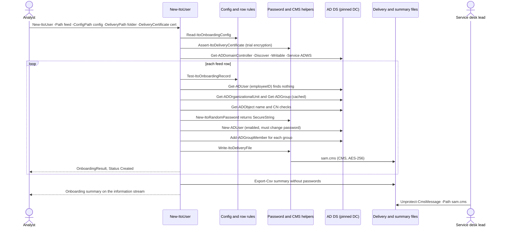

**Pipeline variant (`-InputObject`).** `$rows | New-ItoUser -ConfigPath ...` takes the rows as
objects or hashtables instead of a CSV file. `begin` (step 4) is the same. `process` runs once
per pipeline item, or once for an array given with `-InputObject`, and skips step 5: there is no
`Import-Csv`, no required-column check and no empty-feed warning. `Get-ItoRecordValue` reads each
of the nine fields from a property or hashtable key, matching the name without regard to case;
a missing field reads as an empty string, which `Test-ItoOnboardingRecord` then reports (for
example `GivenName is required.`). Steps 6 to 18 are unchanged. Row numbers, reserved names, the
set of employee IDs seen and the OU and group cache are created in `begin`, so they carry over
from one pipeline item to the next and the whole pipeline is one batch (the Pester test "accepts
rows from the pipeline" checks rows 1 and 2 from an object and a hashtable). An empty pipeline
returns nothing and writes no summary, because `end` returns early when there are no results.

**Failure paths.**

| What goes wrong | Detected in | What the system does | State left behind | Recovery |
| --- | --- | --- | --- | --- |
| Missing or wrong file path, password length out of range (only the paths are tested) | Parameter binding (`ValidateScript`, `ValidateRange`) | Parameter binding error; nothing runs | Nothing changed | Fix the argument |
| `-DeliveryPath` without `-DeliveryCertificate` or the reverse | `New-ItoUser` `begin` | Throws `Use -DeliveryPath and -DeliveryCertificate together: delivery files are always encrypted.` | Nothing changed | Give both |
| AD module not installed | `Assert-ItoActiveDirectory` | Throws the install message (4.2) | Nothing changed | Install RSAT as the message says |
| Invalid configuration (for example `ou=finance,...` in lower case, an unknown setting) | `Read-ItoOnboardingConfig` | Throws `The configuration file '<path>' is not valid:` with every problem | Nothing changed | Fix the file |
| Certificate unusable, unreadable or thumbprint not found | `Assert-ItoDeliveryCertificate`, `Resolve-ItoDeliveryCertificate` | Throws one of the messages in 4.3 | Nothing changed | Use a Document Encryption certificate |
| No domain controller found | `Get-ItoAdParameter` | Throws `No writable domain controller was found: <message> Name one with -Server.` | Nothing changed | Fix DNS or the network, or pass `-Server` |
| Feed lacks a required column | `process`, `Path` parameter set | Throws `The HR feed '<path>' is missing required columns: <list>. Expected columns: <all>.` | Nothing changed | Fix the export |
| Empty feed | `process` | Warning `The HR feed '<path>' has no data rows.`; no results | Nothing changed | None needed |
| Invalid row, including tampered input such as `(`, `*`, `,` or `=` in a name, or a bad date | `Test-ItoOnboardingRecord` | `Invalid` with every problem; warning `Row <n> was not processed: <problems>`; next row | Nothing created for the row | HR corrects the row; rerun the feed |
| Pipeline object without a required property (`-InputObject`; not tested with pipeline input, the same check is tested with CSV rows) | `Test-ItoOnboardingRecord` | `Invalid`: `<Field> is required.`; there is no whole-feed column check, so each such row is reported on its own | Nothing created for those rows | Fix the objects and run again |
| Employee ID repeated in the feed | `New-ItoUser` (`$seenEmployeeIds`) | Later row `Invalid`: `EmployeeId '<id>' appears more than once in this feed.` | First occurrence processed | HR removes the duplicate |
| Employee ID already has an account (rerun) | `Get-ADUser` employeeID check | `Exists`: `An account with employee ID <id> already exists (<sam>). No changes were made.` plus a warning per missing configured group | Unchanged | Add missing groups by hand after checking the person still needs them |
| OU or group from the configuration missing | `Get-ItoOnboardingTargetProblem` | `Failed`: `The OU '<ou>' from the configuration could not be found: <message>` or `The group '<group>' from the configuration does not exist in the directory.`; cached, so every row for that department fails the same way | Nothing created for those rows | Create the OU or group, or fix the configuration; rerun |
| DC or permission error during the OU check (not tested with such an error; the same code path is tested with a not-found error) | `Get-ItoOnboardingTargetProblem`, which catches any exception from `Get-ADOrganizationalUnit` | `Failed`: `The OU '<ou>' from the configuration could not be found: <message>`; the failure is cached, so every later row for that OU fails the same way in this run, even after the DC recovers (`onboard-user.sh` caches only answers, see 5.2; D11 in 7.2) | Nothing created for those rows | Fix the cause and rerun |
| Wrong credentials or unreachable DC during the rows (unauthenticated) | First AD cmdlet in the row's `try` | `Failed` with the AD error; warning `Row <n> failed: <message>`; next row | Rows created before the fault remain | Fix the credential or connectivity; rerun (created rows report `Exists`) |
| No right to create users (forbidden) | `New-ADUser` | `Failed` with the AD access error | Nothing created for the row | Grant rights or use another credential; rerun |
| No right to change a group (forbidden) | `Add-ADGroupMember` | Row stays `Created` with warning `Could not add the account to group '<group>': <message>` | Account exists without that group | Add by hand; a rerun reports the missing group but does not add it |
| All 99 candidate names taken (not tested) | `Resolve-ItoSamAccountName` | `Failed`: `No free account name was found for '<given> <surname>' after 99 attempts.` | Nothing created | Create the account by hand |
| Password generator cannot avoid the excluded names | `New-ItoRandomPassword` | `Failed`: `Could not generate a password without the excluded substrings after 100 attempts.` | Nothing created (it runs before `New-ADUser`) | Rerun the row |
| Delivery file cannot be written | `Write-ItoDeliveryFile` | `Created` with warning `The password delivery file could not be written: <message> The password is still available on the InitialPassword property of this result.` | Account exists; password only on the result | Encrypt it from `$results`, or reset the password (KB 02) |
| Real run without `-DeliveryPath` | `end` block | Warning: `<n> account(s) were created without -DeliveryPath, so their initial passwords exist only on the InitialPassword property (a SecureString) of the results. ...` | Passwords only on the results | Keep `$results`; otherwise reset those passwords |
| Session ends after `New-ADUser` but before delivery (not tested) | Not detected | None | Account exists, password lost | Rerun reports `Exists`; reset the password (KB 02) |
| Summary file cannot be written | `Export-Csv` in `end` (not tested) | PowerShell reports the `Export-Csv` error after every row has run | Accounts and delivery files complete; no summary | Build the summary from `$results` |
| Two runs at the same time with overlapping feeds (concurrency; not tested, not handled) | Nothing in the tool | No lock. Reservations are per run, so both runs can choose the same name. If both use the same DC (the same `-Server`), the second create is refused (`sAMAccountName` must be unique), giving `Failed`; without `-Server`, each run pins the writable DC it discovers, and if they pinned different DCs both creates can succeed and the duplicate `sAMAccountName` appears only after replication. If both runs pass the employee ID check before either creates, the second can create a second account for the same person under the next free name, because `employeeID` is not a unique attribute | Possibly a duplicate account | Run feeds from one place at a time; find duplicates with `Get-ADUser -LDAPFilter '(employeeID=<id>)'` and offboard the extra one |

### 5.2 Onboarding against Samba AD (onboard-user.sh)

**Trigger and actors.** As 5.1, on a Linux host that manages a Samba AD domain. Actors:
analyst, HR, Samba AD DC, service desk lead.

**Preconditions.** `jq`, `python3`, `ldbsearch`, `ldbadd`, `samba-tool`, `base64`, `iconv` and,
for real runs, `openssl`; an authentication file with mode 600; a reachable DC URL; a valid
configuration; OUs and groups exist; a PEM delivery certificate with an RSA key; a writable
delivery folder.

**Happy path.**

1. Preview: `linux/onboard-user.sh --csv examples/new-starters.csv --config config/onboarding.json --url ldap://dc1.corp.example.com --auth-file ~/.config/it-ops/admin.auth --dry-run`.
   Valid rows come back `Planned`; names are reserved within the batch; nothing changes.
2. Real run with `--deliver-dir DIR --deliver-cert FILE` (and optionally `--summary FILE`).
3. Option checks; files readable; `check_secret_file` on the authentication file;
   `require_cmd`; `config_check` prints nothing; `upnSuffix` (lower-cased) and
   `samAccountNameFormat` read.
4. Real run only: `openssl` present, delivery folder writable, certificate readable, trial
   `openssl cms -encrypt` succeeds.
5. A private temporary folder (removed on exit) and `umask 077`.
6. `python3 -I linux/lib/hrfeed.py <csv>` writes one line per row to the temporary folder.
7. `directory_base_dn` reads `defaultNamingContext` from the rootDSE.
8. For each line: rows with problems are `Invalid`; the department is looked up without regard
   to case; groups listed once each.
9. Employee ID search finds nothing.
10. `ou_exists` and `group_exists` succeed (answers cached).
11. `resolve_account_name` picks the first candidate not reserved and not used as a
    `sAMAccountName` or UPN prefix.
12. CN check in the OU, manager lookup, description built.
13. `generate_password` draws from `/dev/urandom` (same character set as PowerShell) and avoids
    the account name and name parts.
14. One LDIF record goes through a pipe to `ldbadd`, with `userAccountControl: 512`, the
    `unicodePwd` value and `pwdLastSet: 0`; the directory creates the account completely or not
    at all.
15. `samba-tool group addmembers` for each group.
16. `deliver_password` pipes the text to `openssl cms -encrypt -binary -aes256 -outform PEM` and
    writes `DIR/<sam>.cms` (mode 600); the variable holding the password is cleared.
17. The row is reported `Created`; after the loop, `Onboarding summary: <counts>.`; the summary
    CSV if asked; exit 0.
18. The service desk decrypts with
    `openssl cms -decrypt -binary -inform PEM -in <sam>.cms -inkey key.pem -recip cert.pem`.

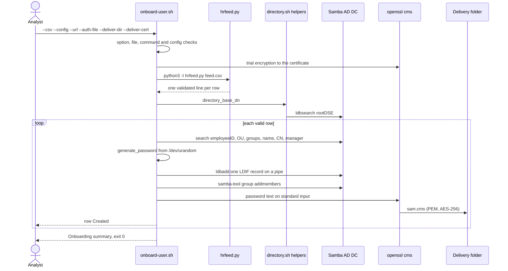

**Failure paths.**

| What goes wrong | Detected in | What the system does | State left behind | Recovery |
| --- | --- | --- | --- | --- |
| Unknown option, missing `--csv`, `--config`, `--url` or `--auth-file`, bad URL, bad password length | Option checks | Exit 64 with, for example, `Missing --url (or set ITO_LDAP_URL).` or `'<url>' is not an ldap:// or ldaps:// URL.` | Nothing changed | Fix the command |
| Real run without delivery options | Option checks | Exit 64: `Real runs need --deliver-dir and --deliver-cert: the initial passwords are only ever written encrypted.` | Nothing changed | Add both options |
| Feed, configuration or delivery certificate file unreadable (not tested) | File checks | Exit 66: `The HR feed '<file>' does not exist or cannot be read.`, or the same sentence for `The configuration file` or (real runs) `The delivery certificate` | Nothing changed | Fix the path or permissions |
| Authentication file missing or unreadable (not tested in `onboard-user.bats`; `check_secret_file` itself is tested in `tests/bats/lib.bats`) | `check_secret_file` | Exit 66: `The authentication file '<path>' does not exist or cannot be read.` | Nothing changed | Fix the path, or set `ITO_AUTH_FILE` |
| Authentication file readable by others (exposed secret) | `check_secret_file` | Exit 77: `The authentication file '<path>' can be read by other users (mode <mode>). Run: chmod 600 '<path>'` | Nothing changed | `chmod 600` |
| A required command missing | `require_cmd` | Exit 69: `Required command '<cmd>' was not found. Install it and try again.` | Nothing changed | Install it |
| Invalid configuration | `config_check` | Exit 65: `The configuration file '<file>' is not valid:` with every problem | Nothing changed | Fix the file |
| Delivery folder not writable (not tested) | Real-run checks | Exit 73: `The delivery folder '<dir>' does not exist or is not writable.` | Nothing changed | Fix the folder |
| Certificate not usable | Trial encryption | Exit 65: `The delivery certificate '<file>' cannot be used for encryption. It must be a PEM certificate with an RSA key.` | Nothing changed | Use a PEM RSA certificate |
| Feed lacks required columns or cannot be decoded | `hrfeed.py` (exit 2) | Exit 65 with the reader's message, for example `The HR feed '<file>' is missing required columns: ...`; an unexpected Python error is shown in full | Nothing changed | Fix the export |
| Empty feed | `hrfeed.py` output is empty | Warning `The HR feed '<file>' has no data rows.`; exit 0 | Nothing changed | None needed |
| Directory unreachable or bind refused (unauthenticated) | `directory_base_dn` | Exit 69: `Could not read the directory at <url>: <first error line>` | Nothing changed | Fix the URL, network or credentials |
| Invalid row or unknown department (validation, tampered input) | `hrfeed.py`, `config_department` | `Invalid` with the problems, or `Department '<name>' is not in the configuration. Known departments: <list>.`; next row; exit 1 at the end. `hrfeed.py` does not check departments, so a row whose only problem is an unknown department still records its employee ID, and a later valid row with the same ID is `Invalid`: `EmployeeId '<id>' appears more than once in this feed.` (see 4.1) | Nothing created for the row | Correct the row and rerun |
| Employee ID already has an account | Employee ID search | `Exists`, plus `The existing account is not in the configured group '<group>'. ...` for each missing group | Unchanged | Add groups by hand if still needed |
| A search fails mid-run (network or DC fault) | `directory_search` | `Failed`: `Directory search failed: <error>` (or `... while checking the OU '<ou>': ...`, `... the group '<group>': ...`, `... choosing an account name: ...`, `... checking the name '<name>' in '<ou>': ...`); failures are not cached, so later rows retry | Earlier rows complete | Rerun when the DC is back |
| OU or group missing | `ou_exists`, `group_exists` | `Failed`: `The OU '<ou>' from the configuration could not be found.` or `The group '<group>' from the configuration does not exist in the directory.` | Nothing created for the row | Create it or fix the configuration |
| All 99 candidate names taken (not tested) | `resolve_account_name` | `Failed`: `No free account name was found for '<display name>' after 99 attempts.` | Nothing created | Create the account by hand |
| Manager cannot be looked up or not found | Manager search | Warning on the row; account still created without a manager | Account without manager | Set the manager by hand |
| Password generator cannot avoid the names (not tested) | `generate_password` (100 attempts) | `Failed`: `Could not generate a password without the account or display name.` | Nothing created (it runs before `ldbadd`) | Rerun the row |
| `ldbadd` refused (rights, constraint, or a name taken by a concurrent run) | `ldap_add` | `Failed`: `The directory refused the new account: <first error line>`; lines containing `unicodePwd` are never shown | No account: the add is atomic | Fix the cause and rerun |
| Group add refused | `samba-tool group addmembers` | Warning `Could not add the account to group '<group>': <error>` on a `Created` row | Account without that group | Add by hand |
| Delivery file cannot be written (not tested) | `deliver_password` | Warning `The password delivery file could not be written: <error>. Reset the password to hand the account over.`; the password is discarded | Account exists, password unknown | `samba-tool user setpassword <sam> --must-change-at-next-login` (KB 02) |
| Summary file cannot be written (not tested) | Redirection under `set -e` | The script stops with exit 1 after the loop and the on-screen summary | All rows processed; no summary file | Copy the on-screen table; rerun later reports `Exists` |
| Two runs at once (concurrency; not tested, not handled) | Nothing in the script | As in 5.1: no lock. A name clash makes `ldbadd` fail when both runs use the same DC (`--url`); with different DCs, both adds can succeed and the duplicate name appears after replication. A second account for one employee ID is possible either way | Possibly a duplicate | Run feeds from one place at a time |

### 5.3 Offboarding on Windows (Remove-ItoUser)

**Trigger and actors.** A leaver ticket (for example `INC0012345`). Actors: analyst, AD DS,
auditor (reads the audit CSV later).

**Preconditions.** RSAT; rights to disable, edit and move the user and change its groups; an
existing audit folder; a valid configuration or a `-DisabledOu`.

**Happy path.**

1. Preview: `Remove-ItoUser -Identity omar.haddad -TicketNumber INC0012345 -ConfigPath .\onboarding.json -AuditPath \\fs01\Audit -WhatIf`
   gives `Planned` and the list of changes.
2. Real run (PowerShell asks before each step because `ConfirmImpact` is High; batch runs pass
   `-Confirm:$false`).
3. `begin`: `Assert-ItoActiveDirectory`; the disabled OU from the configuration; one domain
   controller; ticket upper-cased; audit folder resolved.
4. `Get-ADUser` reads `MemberOf`, `Description`, `Enabled`.
5. If the user has groups, `Export-ItoGroupAudit` writes
   `<account>_<TICKET>_<yyyyMMddTHHmmssZ>_groups.csv` first.
6. `Disable-ADAccount` if enabled.
7. `Set-ADUser -Description 'Offboarded <date> ticket <TICKET> | previous: <old>'` unless the
   ticket already appears as a whole token.
8. `Remove-ADGroupMember` for each group (only because the export was written).
9. `Move-ADObject` to the disabled users OU if not already there.
10. Result `Offboarded` with `<account> offboarded under <TICKET>: <actions>.`

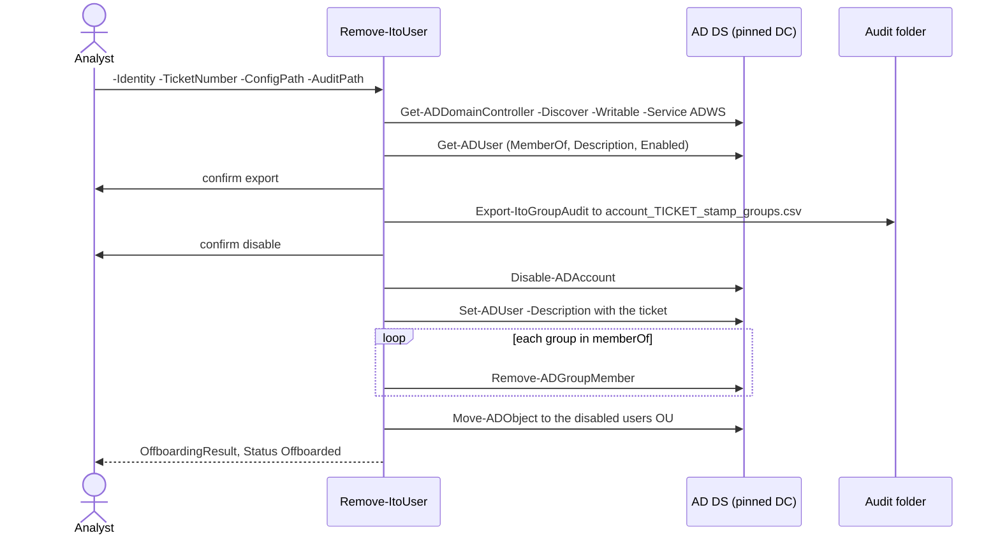

**Failure paths.**

| What goes wrong | Detected in | What the system does | State left behind | Recovery |
| --- | --- | --- | --- | --- |
| Account name with LDAP filter characters, bad ticket number, lower-case `-DisabledOu` (tampered or mistyped input) | Parameter validation | Parameter binding error | Nothing changed | Fix the argument |
| Account not found | `process` | `Failed` result and error `Offboarding <id> failed: No user account named '<id>' was found.`; pipeline continues | Nothing changed | Check the name |
| AD module missing, invalid configuration, no domain controller (not tested in `Remove-ItoUser.Tests.ps1`; the same helpers are tested through `New-ItoUser` and `Module.Tests.ps1`) | `begin` | Terminating error (messages in 4.1 and 4.2) | Nothing changed | As the message says |
| Audit export fails (folder not writable) | `Export-ItoGroupAudit` (`-ErrorAction Stop`) | `Failed`, `Offboarding <id> failed: <message>` | Nothing changed: the export is the first step | Fix the folder; rerun |
| Analyst answers No to the export | `ShouldProcess` | Groups are not removed; other accepted steps run; `Partial` with `... Not done (declined): ... remove <n> group membership(s), skipped because the audit export was declined ... Run Remove-ItoUser again to finish.` | Partly offboarded, groups kept | Rerun and accept |
| Analyst declines every step | `ShouldProcess` | `Declined`: `No changes were made: every step was declined (<steps>).` | Nothing changed | Rerun |
| No right to disable, edit, remove or move (forbidden; not tested) | The AD cmdlet (`-ErrorAction Stop`) | `Failed` with the AD error; later steps not run | Earlier steps done (for example the audit file written and account disabled) | Fix rights; rerun, which skips the steps already done |
| DC fails in the middle of group removal (not tested) | `Remove-ADGroupMember` | `Failed`; `GroupsRemoved` lists those removed | Some groups removed; the first audit file has the full list | Rerun; it exports the remaining groups to a second audit file and finishes |
| Run twice (idempotency) | State checks | `AlreadyOffboarded`: `<id> is already offboarded. No changes were needed.` | Unchanged | None needed |
| Two runs at once for one account (concurrency; not tested) | AD cmdlets | A step the other run has just done may fail (for example removing a membership that is already gone), giving `Failed` | Offboarding complete or nearly so | Rerun; it reports `AlreadyOffboarded` or finishes |

### 5.4 Offboarding against Samba AD (offboard-user.sh)

**Trigger and actors.** As 5.3, against Samba AD.

**Preconditions.** `ldbsearch`, `ldbmodify`, `samba-tool`, `base64` (and `jq` with `--config`);
authentication file mode 600; a writable audit folder.

**Happy path.**

1. Preview with `--dry-run`: one `Would ...` line per step, then
   `Planned: no changes were made (--dry-run).`, exit 0.
2. `linux/offboard-user.sh --user sara.ali --ticket INC0012345 --audit-dir /srv/it-ops/audit --config config/onboarding.json`.
3. Checks: options, audit folder writable, authentication file, commands, configuration, DN
   pattern of the target OU.
4. Base DN from the rootDSE; one search returns `distinguishedName`, `userAccountControl`,
   `description`, `memberOf`.
5. Audit CSV written first (if there are groups).
6. `samba-tool user disable` unless bit 2 of `userAccountControl` is set.
7. `ldbmodify` replaces the description (cut to 1024 bytes) unless the ticket is already a whole
   token in it.
8. `ldbmodify` deletes the `member` value from each group.
9. `samba-tool user move` to the disabled OU unless already there.
10. `Offboarded <account> under <TICKET>: <actions>.`, exit 0.

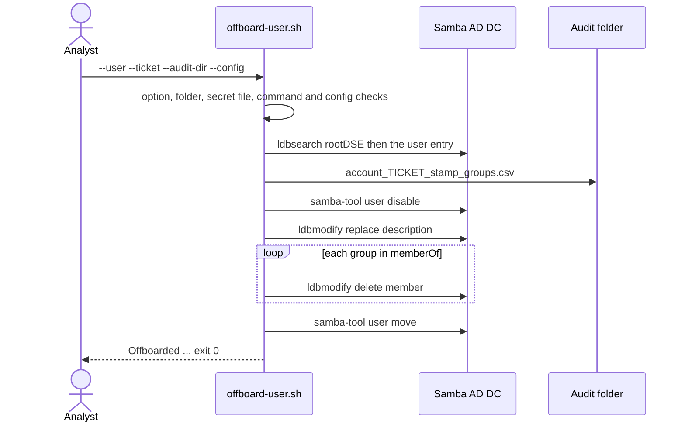

**Failure paths.**

| What goes wrong | Detected in | What the system does | State left behind | Recovery |
| --- | --- | --- | --- | --- |
| Bad account name, ticket, missing or conflicting `--config`/`--disabled-ou`, bad OU DN, bad URL | Option checks | Exit 64, for example `'<ticket>' is not a ticket number such as INC0012345 or REQ-2041.` or `Give --config or --disabled-ou, not both.` | Nothing changed | Fix the command |
| Audit folder missing or not writable | Folder check | Exit 73: `The audit folder '<dir>' does not exist or is not writable.` | Nothing changed | Fix the folder |
| Authentication file exposed or missing (not tested in `offboard-user.bats`; `check_secret_file` itself is tested in `tests/bats/lib.bats`) | `check_secret_file` | Exit 77 or 66 (messages as in 5.2) | Nothing changed | `chmod 600` or fix the path |
| Invalid configuration (not tested in `offboard-user.bats`; `config_check` itself is tested in `tests/bats/lib.bats`) | `config_check` | Exit 65: `The configuration file '<file>' is not valid:` with every problem | Nothing changed | Fix the file |
| Directory unreachable or bind refused (not tested in `offboard-user.bats`; the same check is tested in `onboard-user.bats`) | `directory_base_dn` | Exit 69: `Could not read the directory at <url>: <error>` | Nothing changed | Fix connectivity or credentials |
| Search fails (not tested) | User search | Exit 1: `Offboarding <account> failed: Directory search failed: <error>` | Nothing changed | Rerun |
| Account not found | User search | Exit 1: `Offboarding <account> failed: No user account named '<account>' was found.` | Nothing changed | Check the name |
| Audit file cannot be written (not tested) | Step 1 | Exit 1: `... Could not write the audit file '<file>': <error>` | Nothing changed | Fix the folder; rerun |
| A change refused (forbidden) or the DC fails mid-run (tested only for a refused disable) | Steps 2 to 5 | Exit 1 with `Could not disable the account: ...`, `Could not update the description: ...`, `Could not remove the account from '<group>': ...` or `Could not move the account: ...` | Earlier steps done | Fix the cause; rerun finishes the remaining steps |
| The account's DN has no parent that `dn_parent` can read (not tested) | Step 5, `dn_parent` | Exit 1: `Offboarding <account> failed: Could not read the parent of '<dn>'.` | Steps 1 to 4 done; the account is not moved | Move the account by hand |
| Run twice | State checks | `Already offboarded: <account> needed no changes.`, exit 0, no new audit file | Unchanged | None needed |
| Two runs at once for one account (concurrency; not tested, not handled) | Nothing in the script | No lock. Both runs read the same entry, so both export the groups (two audit files, or one written twice when both export in the same second) and both try every step; a step the other run has just done may fail (for example deleting a `member` value that is already gone), giving exit 1 | Offboarding complete or nearly so | Rerun; it reports `Already offboarded` or finishes |

### 5.5 Lockout tracing (Get-ItoLockoutSource)

**Trigger and actors.** A user reports repeated lockouts (KB 01). Actors: analyst, PDC
emulator.

**Preconditions.** RSAT; read access to users; Event Log Readers on the domain controllers and
the Remote Event Log Management firewall rule; lockout auditing enabled.

**Happy path.**

1. `Get-ItoLockoutSource -Identity sara.ali` (optionally `-Hours 72`).
2. `begin`: `Assert-ItoActiveDirectory`; `Get-ADDomain` gives `PDCEmulator`.
3. `Get-ADUser` on the PDC emulator reads the lockout state and counters.
4. `Get-ItoLockoutEventData` reads events 4740 from the Security log for the window and maps
   properties 0 and 1 to `TargetUserName` and `CallerComputer`.
5. Events for other accounts are dropped; the rest are sorted newest first and grouped by caller
   computer, most lockouts first.
6. Advice names the top caller computer and the usual causes; the analyst fixes the cause, then
   unlocks.

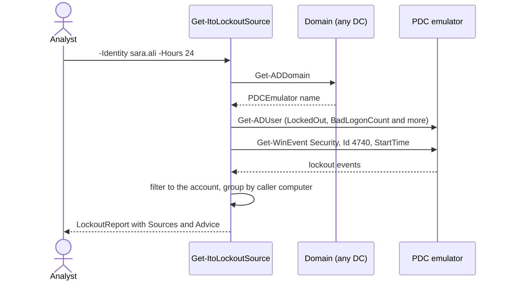

**Failure paths.**

| What goes wrong | Detected in | What the system does | State left behind | Recovery |
| --- | --- | --- | --- | --- |
| Account name with LDAP characters or hours out of range (only the account name is tested) | Parameter validation | Parameter binding error | Nothing read | Fix the argument |
| Domain unreachable (not tested) | `Get-ADDomain` (`-ErrorAction Stop`) in `begin` | Terminating error from the AD module | Nothing read | Fix connectivity or pass `-Server` |
| PDC emulator unreachable after the domain lookup (not tested) | `Get-ADUser` on the PDC emulator, outside any `try`/`catch` | The AD module's error reaches the caller; no report for that account | Nothing changed | Fix connectivity to the PDC emulator and rerun |
| Account not found | `process` | Non-terminating error `No user account named '<id>' was found.`; next input | Nothing read | Check the name |
| No Event Log Readers right or firewall rule (forbidden) | `Get-ItoLockoutEventData` | Report still returned with `Warning` set and a warning written (message in 4.6) | Nothing changed | Request the right or rule |
| No events in the window | `NoMatchingEventsFound` | Empty `Sources`; advice says the account is locked but no event was found, or that it is not locked | Nothing changed | Widen `-Hours`; check auditing |
| Events name no caller computer | Advice logic | Advice points at services such as Exchange, ADFS or a VPN server | Nothing changed | Check that server's logs |

### 5.6 Windows health report (Get-ItoHealthReport)

**Trigger and actors.** A "slow PC" or "disk full" ticket (KB 06, KB 07), or a routine check.
Actors: analyst or user, the local computer.

**Preconditions.** Windows; the module imported; elevation for BitLocker status.

**Happy path.**

1. `Get-ItoHealthReport -OutputDirectory $env:TEMP` (optionally `-ThresholdPath`,
   `-EventWindowHours`).
2. `Test-ItoWindowsPlatform`; `Read-ItoHealthThreshold` merges the file over the defaults.
3. Seven collectors run in order, each in its own `try`/`catch`: disk space, memory and uptime,
   pending reboot, automatic services (using the boot time the memory collector read), critical
   events, last update installed, BitLocker.
4. `Get-ItoOverallStatus` picks the worst status.
5. With `-OutputDirectory`: `ShouldProcess` for each file; JSON via `ConvertTo-Json -Depth 6`
   and HTML via `ConvertTo-ItoHealthHtml`, both UTF-8 without BOM, named
   `health-<computer>-<stamp>.json` and `.html`.
6. The report object is returned with `JsonPath` and `HtmlPath`.

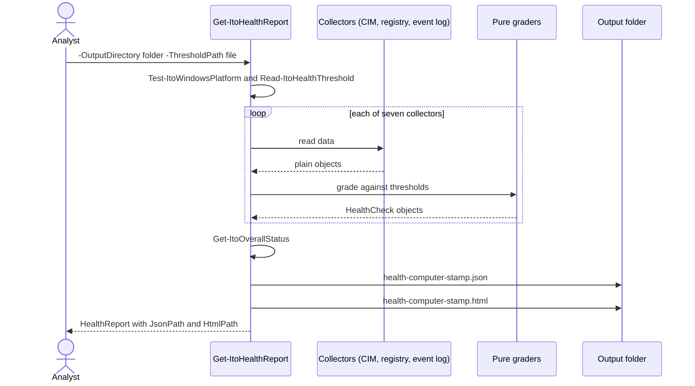

**Failure paths.**

| What goes wrong | Detected in | What the system does | State left behind | Recovery |
| --- | --- | --- | --- | --- |
| Run on Linux or macOS | `Test-ItoWindowsPlatform` | Throws `Get-ItoHealthReport reads Windows data sources (CIM, the registry and the event log), so it runs on Windows only. On Linux use linux/health-report.sh.` | Nothing written | Use `health-report.sh` |
| Output folder or threshold file missing (only the output folder is tested) | Parameter validation | Parameter binding error | Nothing written | Fix the path |
| Invalid threshold file (unknown key, text instead of a number, negative value, critical better than warning) | `Read-ItoHealthThreshold` | Throws `The threshold file '<path>' is not valid:` with each problem, for example `Unknown threshold '<key>'.` | Nothing written | Fix the file |
| A data source fails (CIM error, access denied) | Collector `try`/`catch` | That area becomes `Unknown` with `The data could not be read: <message>`; the rest run | Report complete except that area | Investigate the data source |
| Not elevated, or no BitLocker module | `Get-ItoBitLockerData` | `Unknown` with `BitLocker status could not be read (<message>). Run the report as an administrator.` or `The BitLocker PowerShell module is not available on this system.` | Report complete | Run elevated |
| No hotfix with an installation date | `Get-ItoUpdateCheck` | `Unknown`: `No installed updates with an installation date were found.` | Report complete | Check Windows Update history |
| Files cannot be written | `try`/`catch` around the writes | Warning `The report could not be written to '<dir>': <message> The checks are still in the returned report object.` | No files or one file; report returned | Write elsewhere |
| Untrusted text in event messages or service names | `ConvertTo-ItoHtmlText` | HTML-encoded; JSON escaped by `ConvertTo-Json` | Safe report | None needed |
| `-WhatIf` | `ShouldProcess` | No files written; report returned | Nothing written | None needed |

### 5.7 Linux health report (health-report.sh)

**Trigger and actors.** A scheduler, a monitoring system or an analyst. Actors: the operator or
scheduler, the local machine.

**Preconditions.** Bash, `awk`, `df`; optional `systemctl`, `journalctl`, `findmnt`, `lsblk`,
`needs-restarting`, `rpm`. Root for the full journal.

**Happy path.**

1. `linux/health-report.sh --format json --output /var/tmp/health.json` (or text by default).
2. Options and every threshold variable are validated.
3. `check_disks` (real filesystems from `df -P -k -T`, plus `/` even when it is an overlay),
   `check_memory` (`MemTotal - MemAvailable`), `check_uptime`, `check_reboot`, `check_units`,
   `check_journal`, `check_updates` (newest dpkg `upgrade`, rotated logs included, or the rpm
   database), `check_encryption` (`crypt` in the `lsblk -s` chain of the root device).
4. The worst status becomes `OVERALL`; the chosen renderer writes the report.
5. Exit 0, 1, 2 or 3 for OK, Warning, Critical or Unknown.

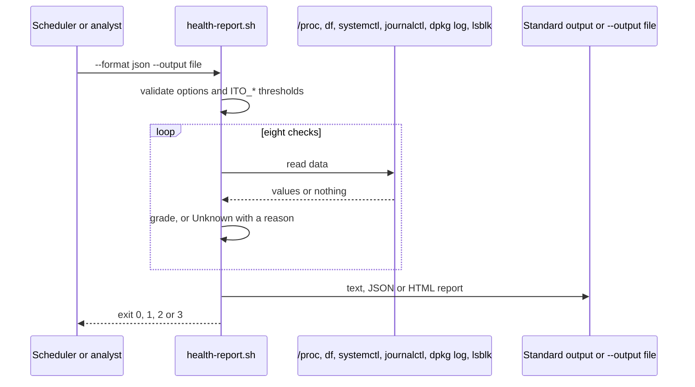

**Failure paths.**

| What goes wrong | Detected in | What the system does | State left behind | Recovery |
| --- | --- | --- | --- | --- |
| Unknown option, bad format or hours | Option checks | Exit 64, for example `--format must be text, json or html.` | Nothing written | Fix the command |
| Threshold not a whole number, or critical better than warning | Threshold checks | Exit 64, for example `ITO_DISK_FREE_CRIT must not be greater than ITO_DISK_FREE_WARN (less free space is worse).` or `The MEMORY critical threshold must not be lower than the warning threshold.` | Nothing written | Fix the variable |
| No systemd (containers) | `check_units`, `check_journal` | `Unknown` with `systemd is not running here (for example inside a container).` (failed units) and `The systemd journal is not available here (for example inside a container).` (journal); exit 3 if nothing is worse | Report written | Expected in containers |
| Root is not a block device | `check_encryption` | `Unknown`: `The root filesystem is not a block device (<source>), so encryption cannot be checked here.` | Report written | Expected in containers |
| No package history | `check_updates` | `Unknown`: `No package history was found (dpkg log or rpm database).` | Report written | None |
| `/proc/meminfo` or `/proc/uptime` unreadable (not tested) | `check_memory`, `check_uptime` | `Unknown` with `Could not read <path>.` | Report written | Check the system |
| Not run as root (not tested) | `check_journal` | Note `Run as root to include the whole system journal.` | Report written | Run as root |
| `--output` cannot be written (not tested) | The redirection, under `set -e` | The script stops with exit 1, which a monitoring system reads as Warning rather than Unknown | No report file | Fix the path; see decision D7 in 7.2 |

### 5.8 Network check in PowerShell (Test-ItoNetwork)

**Trigger and actors.** "The internet is down", "the share cannot be found" (KB 03, 04, 09).
Actors: analyst or user, local network, DNS servers, target host.

**Preconditions.** The module imported. No rights needed.

**Happy path.**

1. `Test-ItoNetwork` (defaults `www.microsoft.com`, port 443) or
   `Test-ItoNetwork -ComputerName fs01.corp.example.com -Port 445 -ControlName corp.example.com -SkipTrace`.
2. IP configuration: an up, non-loopback adapter with an IPv4 address that is not `169.254.*`,
   preferring one with a gateway.
3. Default gateway: ping with the timeout (no answer is `Warn`, not `Fail`).
4. DNS servers: configured on the usable adapters, ignoring Windows' `fec0:0:0:ffff::1` to `::3`
   placeholders.
5. DNS resolution: `Dns.GetHostAddresses`, IPv4 first; skipped for an IP address.
6. TCP port: `TcpClient.ConnectAsync` with a timeout.
7. HTTPS (port 443 only): `HEAD` request; any HTTP status counts as success.
8. Route trace (IPv4 only): pings with a TTL of 1, 2, 3 and so on up to `-MaxHops`, waiting at
   most 1 second per hop, until the target answers.
9. `Get-ItoNetworkDiagnosis` returns `No fault found: ...`; `Healthy` is `$true`.

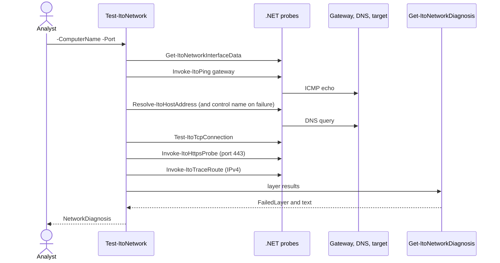

**Failure paths.** The tool reports these rather than failing; the first matching rule in
`Get-ItoNetworkDiagnosis` wins.

| What goes wrong | Detected in | What the system does | State left behind | Recovery (from the diagnosis) |
| --- | --- | --- | --- | --- |
| Invalid host name or range (tampered input) | Parameter validation | Parameter binding error | Nothing | Fix the argument |
| No adapter up | Layer 1, `NoAdapter` | Other layers `Skip`; `FailedLayer` IP configuration | Read only | Cable, Wi-Fi, flight mode, adapter enabled |
| Only 169.254.x.x | Layer 1, `Apipa` | As above | Read only | `ipconfig /renew`; check the switch port, Wi-Fi or DHCP scope |
| No IPv4 address (not tested in Pester; `net-check.bats` covers the Bash equivalent) | Layer 1, `NoAddress` | As above | Read only | Check DHCP or static settings |
| No default gateway | Layer 2, `NoGateway` | `FailedLayer` default gateway | Read only | Check DHCP options or static settings |
| Gateway ignores ping | Layer 2, `GatewayNoReply` | `Warn`; mentioned in a healthy diagnosis or blamed when TCP also fails | Read only | Often by design |
| Name does not exist, control name resolves | Layer 4, `NameNotFound` | `DNS works, but the name '<target>' does not resolve. ...` | Read only | Spelling, record, VPN (split DNS) |
| DNS servers do not answer | Layer 4, `DnsDown` | `Name resolution is failing: the DNS servers did not answer. ...` | Read only | `ipconfig /flushdns`, check reachability, VPN or proxy |
| No DNS servers configured | Layer 3, `NoDnsServers` | `Warn`; blamed if resolution also fails | Read only | Set DNS servers |
| Port refused | Layer 5, `TcpRefused` | `'<target>' answered but refused port <port>. ...` | Read only | Service not listening or firewall rejecting |
| Port times out | Layer 5, `TcpTimeout` | `Port <port> on '<target>' did not answer. ...`, plus where the trace stops when it stopped part-way (`TraceStopped`) | Read only | Firewall or server down |
| TLS handshake fails | Layer 6, `HttpsTls` | Advice on date and time, proxy and TLS inspection root certificate | Read only | As advised |
| Web server slow or proxy not found (not tested in Pester; `net-check.bats` covers the Bash equivalent) | Layer 6, `HttpsTimeout`, `HttpsProxy` | Matching advice | Read only | As advised |
| Any other HTTPS failure (not tested) | Layer 6, `HttpsName`, `HttpsConnect`, `HttpsOther` | `Port <port> on '<target>' accepts connections, but the HTTPS request failed: <detail>` | Read only | Read the detail |
| IPv6-only target (not tested) | Layer 7 | Trace `Skip`: `Skipped: the trace supports IPv4 targets only.` | Read only | None |
| ICMP blocked on the path (not tested in Pester; `net-check.bats` covers the Bash equivalent) | Layer 7, `TraceSilent` | `Info` only; never a failure | Read only | None |

### 5.9 Network check on Linux (net-check.sh)

**Trigger and actors.** As 5.8 on Linux, by hand or from monitoring (exit 1 on a fault).

**Preconditions.** `ip`, `getent`, `timeout`; optional `ping`, `curl`, `resolvectl`,
`traceroute` or `tracepath`.

**Happy path.**

1. `linux/net-check.sh` or `linux/net-check.sh --port 445 --no-trace --control-name corp.example.com fs01.corp.example.com`.
2. IP configuration from `ip -o link show up` and `ip -o -4 addr show up`, preferring the
   interface of the default route.
3. Gateway from `ip -4 route show default`, pinged when `ping` exists.
4. DNS servers from `/etc/resolv.conf`, or from `resolvectl dns` when it lists only
   `127.0.0.53`.
5. `getent ahostsv4` (then `ahosts`) resolves the target through NSS.
6. `timeout <s> bash -c 'exec 3<>"/dev/tcp/$1/$2"'` opens the port.
7. `curl -sS --head --max-time <s>` for port 443.
8. `traceroute -n -q 1 -w 1 -m <hops>` or `tracepath -n -m <hops>`.
9. `diagnose` prints the diagnosis; text or `--json`; exit 0.

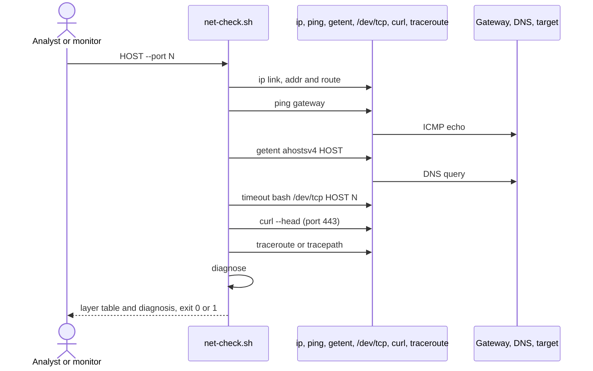

**Failure paths.**

| What goes wrong | Detected in | What the system does | State left behind | Recovery |
| --- | --- | --- | --- | --- |
| Bad host, port, timeout or hops | Option checks | Exit 64, for example `'<target>' is not a host name or IP address.` | Nothing | Fix the command |
| `ip`, `getent` or `timeout` missing (not tested) | `require_cmd` | Exit 69: `Required command '<cmd>' was not found. Install it and try again.` | Nothing | Install |
| `ping` missing (not tested) | Layer 2 | `Pass`: `Gateway <ip> (not pinged: ping is not installed).` | Read only | Optional |
| `curl` missing (not tested) | Layer 6 | `Skip`: `Skipped: curl is not installed.` | Read only | Optional |
| No trace tool | Layer 7 | `Skip`: `Skipped: neither traceroute nor tracepath is available.` | Read only | Optional |
| Any layer fault (same rules as 5.8, Linux advice such as `resolvectl flush-caches`, `timedatectl`, `update-ca-certificates`) | `diagnose` | Diagnosis printed, exit 1 | Read only | As advised |
| Shell metacharacters in the host (tampered input) | `HOST_PATTERN` check; the resolved address reaches `bash -c` only as a positional argument, and `curl` gets a URL built from the validated host | Rejected with exit 64 | Nothing | None needed |

### 5.10 Born2beRoot summary (monitoring.sh)

**Trigger and actors.** Root's crontab every ten minutes. Actors: cron, logged-in users.

**Preconditions.** Root; `wall`, `who`, `ip`, `lsblk`, `df`; optional `journalctl` or the sudo
log.

**Happy path.**

1. Cron runs `/usr/local/sbin/monitoring.sh`.
2. Each function reads its source: `uname -a`, `/proc/cpuinfo`, `/proc/meminfo`, `df -P -k`
   (`/dev/*` filesystems once each), two `/proc/stat` samples one second apart, `btime`,
   `lsblk -r -n -o TYPE`, `/proc/net/tcp` and `tcp6` (state `01`), `who`, the default-route
   interface and its MAC, sudo `COMMAND=` lines.
3. The twelve lines are collected and piped to `wall`.

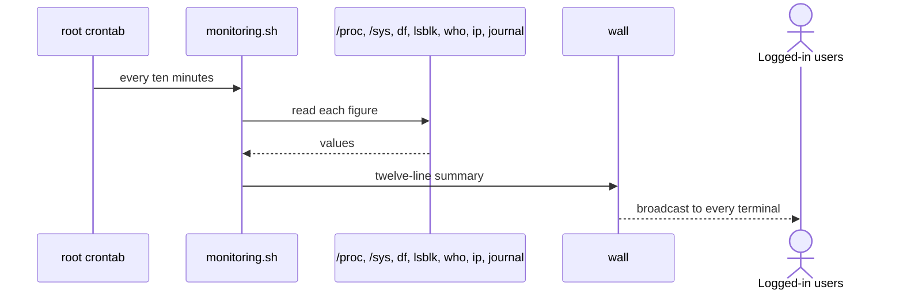

**Failure paths.**

| What goes wrong | Detected in | What the system does | State left behind | Recovery |
| --- | --- | --- | --- | --- |
| Unknown option | Option loop | `monitoring.sh: unknown option <x>`, exit 64 | Nothing broadcast | Fix the crontab line |
| No `physical id` in `cpuinfo` (some VMs, ARM) | `physical_cpus` | Reports 1 | Broadcast | None |
| No LVM, `lsblk` fails | `lvm_in_use` | `#LVM use: no` | Broadcast | None |
| No IPv4 interface | `network` | `#Network: IP none (no network interface with an IPv4 address)` | Broadcast | Check networking |
| No sudo entries in the journal | `sudo_commands` | Counts the sudo log; `0` if neither exists | Broadcast | Configure the sudo log as Born2beRoot asks |
| `wall` missing or failing (not tested) | The final pipe, under `set -euo pipefail` | Non-zero exit; nothing broadcast | Nothing broadcast | Install `wall`, or use `--stdout` |

### 5.11 Password reset with New-ItoRandomPassword

**Trigger and actors.** A password reset ticket (KB 02). Actors: analyst, AD DS, the verified
user.

**Preconditions.** The caller has been verified (KB 02, quick checks); the module imported; AD
rights to reset passwords.

**Happy path.**

1. `$password = New-ItoRandomPassword` (optionally `-Length 24` or `-ExcludeSubstring`).
2. `Set-ADAccountPassword -Identity sara.ali -Reset -NewPassword $password`,
   `Set-ADUser -ChangePasswordAtLogon $true`, `Unlock-ADAccount`.
3. The password is shown once in a dialog box and given to the user by a separate channel;
   `Remove-Variable -Name password`.

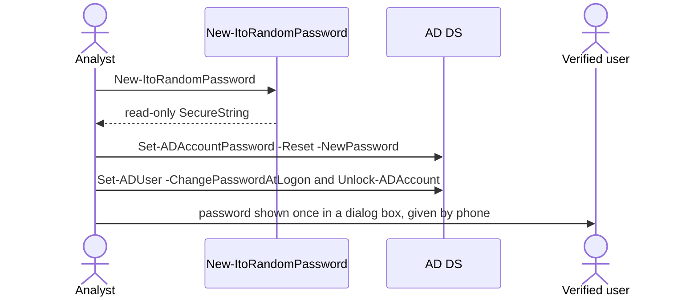

**Failure paths.**

| What goes wrong | Detected in | What the system does | State left behind | Recovery |
| --- | --- | --- | --- | --- |
| Length outside 12 to 128 | `ValidateRange` | Parameter binding error | Nothing | Fix the length |
| Excluded substrings make every attempt clash | Retry loop | Throws `Could not generate a password without the excluded substrings after 100 attempts.` | Nothing | Shorten the exclusion list |
| Password set but the dialog box cannot open (Server Core; not tested) | Outside the module | KB 02 says to run from a workstation with RSAT | Password set | Reset again from a workstation |

### 5.12 Test and CI pipeline

**Trigger and actors.** A push to `main`, any pull request, or a developer running the scripts.
Actors: developer, GitHub Actions, Dependabot.

**Preconditions.** Docker (and Compose v2 for integration); internet access to build images and,
with `-Install`, to the PowerShell Gallery.

**Happy path.**

1. CI starts six jobs in parallel.
2. `powershell`: `scripts/test-powershell.sh` builds the `powershell` image and runs
   `Invoke-Tests.ps1 -Install -MinimumCoverage 80`: hash-checked Pester and PSScriptAnalyzer into
   `out/modules`, the analyzer over `src`, `scripts` and `tests/powershell` (no findings
   allowed), then Pester with coverage; NUnit and coverage XML uploaded.
3. `powershell-windows`: the same Pester run in Windows PowerShell 5.1 and in PowerShell 7.
4. `bash`: shellcheck over every script, library, test and fake; then bats in the `test` image on
   a copy of the tree.
5. `python`: ruff (lint and format check) and `mypy --strict` with hash-locked tools.
6. `integration`: `tests/integration/run.sh` generates an administrator password, starts the
   `dc` service and waits for its health check (an anonymous rootDSE read), prints the Samba
   version, runs `tests/integration/samba-ad.bats` in the client, and removes everything on exit.
7. `workflows`: actionlint.

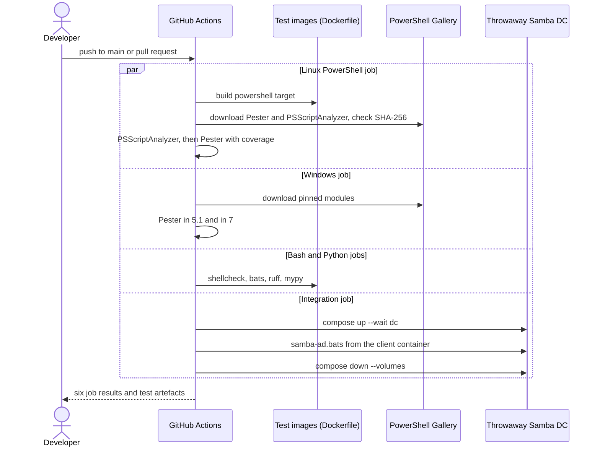

**Failure paths.**

| What goes wrong | Detected in | What the system does | State left behind | Recovery |
| --- | --- | --- | --- | --- |
| Analyzer finding | `Invoke-Tests.ps1` | Table of findings, `PSScriptAnalyzer: <n> finding(s).`, exit 1 | Job failed | Fix the code |
| A test fails | Pester, through `Invoke-Tests.ps1` | Pester lists the failure; the script exits 1; XML results kept as artefacts | Job failed | Fix the code or the test |
| Coverage below 80% | `Invoke-Tests.ps1` | `Coverage is below the minimum of 80%.`, exit 1 | Job failed | Add tests |
| Module not present and no `-Install` (local runs) | `Invoke-Tests.ps1` | Throws `<name> <version> was not found. Run this script again with -Install ...` | Nothing installed | Rerun with `-Install` |
| Downloaded package altered (tampered input) | `Save-PinnedModule` | Deletes the package; throws `The <name> <version> package has SHA-256 <hash>, but <pinned> is pinned. Nothing was installed.` | Nothing installed | Investigate; update the pin only after checking the release |
| bats tarball or PowerShell `.deb` altered | `sha256sum -c` in the Dockerfile | Image build fails | No image | As above |
| Samba DC does not become healthy | `docker compose up --wait` | `run.sh` fails; the `EXIT` trap removes containers and volumes | Nothing left behind | Rerun; check the image build |
| Two runs on one ref | `concurrency` in `ci.yml` | The older run is cancelled | Latest run only | None needed |
| Base image bumped by Dependabot | Pull request CI | Runs the full suite on the bumped image | Pull request open until merged | Review; the `ubuntu:25.10` bump passed and was merged (see 7.2, D1) |

### 5.13 Sample regeneration (scripts/make-samples.sh)

**Trigger and actors.** A change to what a Linux tool prints, or a new base image, makes the
samples in `docs/samples` out of date. Actors: maintainer, Docker, the throwaway Samba DC, the
test and PowerShell containers. No CI job runs this script; shellcheck lints it
(`scripts/test-bash.sh`).

**Preconditions.** A clone of the repository; Docker with Compose v2; internet access (the image
builds download packages, and the network checks use `www.microsoft.com`). On Git Bash the
script sets `MSYS_NO_PATHCONV=1` and mounts the `pwd -W` path itself.

**Happy path.**

1. The maintainer runs `scripts/make-samples.sh` from the clone.
2. Set-up: a random `SAMBA_ADMIN_PASSWORD` for the throwaway domain, a Compose project
   `it-ops-toolkit-samples-<pid>` (or `COMPOSE_PROJECT_NAME`), a temporary folder, and an `EXIT`
   trap that runs `docker compose down --volumes --remove-orphans` and deletes the folder.
3. `docker compose -f tests/integration/compose.yaml build --quiet` builds the `dc` and `test`
   images (`<ITO_TEST_IMAGE>:dc` and `:test`, default prefix `it-ops-toolkit-test`);
   `up --detach --wait dc` waits for the health check (an anonymous rootDSE read); `samba --version`
   is recorded for the header.
4. A client container (`compose run --rm -T --entrypoint bash client`, with
   `ITO_LDAP_URL=ldap://dc`) writes a mode-600 authentication file, creates with `samba-tool` the
   OUs (with their parent `OU=Staff`) and groups that `config/onboarding.example.json` names, and
   makes a two-day self-signed RSA delivery certificate with `openssl req`.
5. In the same container: `linux/onboard-user.sh` twice with `examples/new-starters.csv` (the
   second run shows `Exists`), then `linux/offboard-user.sh --user sara.ali --ticket INC0012345`
   twice (the second shows `Already offboarded`). Each command is printed as `$ <command>` with
   its output, between `=== onboarding ===` and `=== offboarding ===` markers, into a file in the
   temporary folder.
6. `compose down --volumes --remove-orphans` removes the domain. The `section` function (awk)
   cuts the transcript into `docs/samples/samba-onboarding.txt` and `samba-offboarding.txt`, each
   with a first line `# Recorded by scripts/make-samples.sh on <date> in the Samba AD integration environment ...`.
7. `docker run --rm --memory 256m --hostname it-ops-test` with the `test` image and the clone
   mounted read-only runs `linux/health-report.sh`, `linux/monitoring.sh --stdout`,
   `linux/net-check.sh --max-hops 8 www.microsoft.com` and
   `linux/net-check.sh --no-trace intranet.corp.itops.test`, printing `(exit status <n>)` after
   `health-report.sh` and each `net-check.sh`. The output becomes `linux-health-and-monitoring.txt` and `net-check.txt`, with a
   header naming the Debian 13 test container and Docker's operating system.
8. `docker build --target powershell` builds `<prefix>:powershell`; the script reads
   `$PSVersionTable.PSVersion` and runs `Test-ItoNetwork -SkipTrace | Select-Object -ExpandProperty Layers`
   and `(Test-ItoNetwork -ComputerName fileserver.corp.itops.test -Port 445 -SkipTrace).Diagnosis`
   into `test-itonetwork-linux.txt`. Its header comes from a fixed `printf` template that still
   says "Ubuntu 24.04" (priority 2 in 7.1).
9. `Samples written to docs/samples.` The maintainer reviews the change with `git diff` and
   updates `docs/samples/README.md` where a "Where it ran" entry has changed (decision 12).

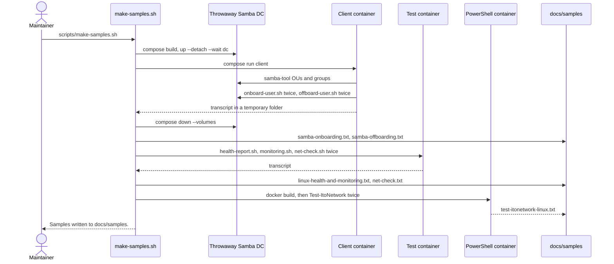

**Failure paths.** The script runs with `set -euo pipefail`, so any failing step outside the
containers stops it, and the `EXIT` trap removes the Compose project and the temporary folder.
The commands inside the containers run without `-e`, so their failures are recorded in the
samples rather than stopping the script.

| What goes wrong | Detected in | What the system does | State left behind | Recovery |
| --- | --- | --- | --- | --- |
| Docker not running, or Compose v2 missing | First `docker compose` call | The script stops with Docker's error | No sample changed | Start Docker; install Compose v2 |
| Image build fails (network down, or a pinned SHA-256 no longer matches) | `compose build --quiet` or `docker build` | The script stops; the build output says why | No sample changed if the Compose build failed; the Samba, health and network samples already rewritten if the `powershell` build failed | Fix the cause; rerun |
| Test DC never becomes healthy | `compose up --detach --wait dc` (its output is discarded) | The script stops with no message from Compose | No sample changed | Run `tests/integration/run.sh`, which shows the Compose output |
| A tool fails inside a container (for example onboarding exits 1) | Not detected | The error output goes into the sample like any other output; exit statuses are printed only for `health-report.sh` and `net-check.sh` | A sample that shows a failure | Read the `git diff` before committing; fix and rerun |
| No internet access during the network checks (images already built) | Not detected | `net-check.sh` and `Test-ItoNetwork` record a failing diagnosis (for example DNS) | Network samples that show a fault | `git restore docs/samples`; rerun with internet access |
| The `Test-ItoNetwork` container exits non-zero | `docker run` in the last pipeline (`pipefail`) | The script stops after `sed` has written what it received | `test-itonetwork-linux.txt` holds only its header and any output before the failure; the other samples are already rewritten | Fix the cause and rerun, or `git restore docs/samples/test-itonetwork-linux.txt` |
| Header text out of date (the image is now `ubuntu:25.10`) | Not detected | The new header says "Ubuntu 24.04" | An inaccurate header | Priority 2 in 7.1 |

## 6. Cross-cutting concerns

### 6.1 Security model

| Concern | Control | Where |
| --- | --- | --- |
| Initial passwords | CSPRNG generation; delivered only as CMS (AES-256) to a certificate, or as a `SecureString`; never on a command line, in output, logs, summaries or transcripts | 4.3, 4.4, 4.10; [decision 3](docs/decisions.md#3-initial-passwords-only-leave-the-tool-encrypted) |
| Module logging (event 4103) | Passwords reach commands only as `SecureString`; encryption by .NET method calls | `Protect-ItoSecretText`; check on a real machine pending |
| Samba password transfer | `unicodePwd` inside LDIF on a pipe to `ldbadd`; Samba signs and seals LDAP | [Decision 4](docs/decisions.md#4-create-samba-accounts-with-one-ldbadd-with-the-password-on-standard-input) |
| Tool errors | `last_error` drops lines containing `unicodePwd` | `linux/onboard-user.sh` |
| Directory credentials | Windows: current user or `-Credential`. Linux: authentication file, mode 600 enforced | 4.2, 4.9 |
| Least privilege | Read-only tools need no write rights; the lockout tool needs only Event Log Readers for the log; the test DC runs unprivileged | 4.6, 4.8, [decision 5](docs/decisions.md#5-an-unprivileged-samba-dc-for-tests-with-xattr_tdb) |
| Injection | Names restricted by `Test-ItoPersonName` and `is_person_name`; LDAP filter escaping on both sides; LDIF base64 for non-ASCII; HTML-encoding and JSON-escaping of untrusted text; host names validated before use | 4.1, 4.7, 4.9, 4.12, 4.13 |
| Personal data at rest | Summary, audit and delivery files belong outside the repository; `.gitignore` covers the usual names; Bash writes them with `umask 077` | README, `.gitignore`, 4.10 |
| Destructive actions | No deletes; `-WhatIf`/`--dry-run`; `Remove-ItoUser` prompts by default; group removal only after the audit export | 4.5, 4.11 |
| Supply chain | Pinned versions and SHA-256 for test tools; Dependabot; CI token read-only | 4.16 |
| Known gaps | No lock against concurrent onboarding runs (5.1, 5.2); summary CSV fields are quoted but a value starting with `=`, `+`, `-` or `@` from an invalid feed row is not neutralised for spreadsheets; the module is not signed | 7.2 (D6, D8, D9) |

### 6.2 Configuration and secrets

| Item | Where | Notes |
| --- | --- | --- |
| Onboarding and offboarding settings | `config/onboarding.json` (copy of the example; ignored by Git) | Shared by both toolkits |
| Health thresholds (Windows) | `-ThresholdPath` JSON (example in `config/`; `/config/health-thresholds.json` ignored by Git) | Keys case-insensitive |
| Health thresholds (Linux) | `ITO_*` environment variables (4.12) | Whole numbers |
| Domain controller | `-Server` or automatic discovery; `--url` or `ITO_LDAP_URL` | |
| Samba credentials | `--auth-file` or `ITO_AUTH_FILE`, mode 600; `*.auth` ignored by Git | Kerberos planned |
| Delivery certificate | Public part only on the onboarding host; private key with the service desk lead | |
| Test-only secrets | `SAMBA_ADMIN_PASSWORD` generated per run by `run.sh` and `make-samples.sh` | Never stored |

### 6.3 Logging and observability

- The tools write no log files of their own. PowerShell uses the standard streams: results on
  output, `Write-Verbose` for each step, `Write-Warning` for row problems and partial results,
  `Write-Information` (tag `Summary`) for the onboarding count, `Write-Error` for failed
  offboardings and unknown accounts.
- Bash writes results to standard output and messages to standard error as
  `<UTC timestamp> <program>: <message>`.
- Durable records: the summary CSV, the audit CSV (with `ExportedAtUtc`), the description stamps
  (`Onboarded <date> by it-ops-toolkit`, `Offboarded <date> ticket <TICKET>`), and the health
  JSON for other tools.
- Monitoring: exit codes (5.7, 5.9); the health JSON's `OverallStatus`.
- CI: NUnit and coverage XML as artefacts; run results on GitHub.

### 6.4 Performance

No timings are published (README). Design points that bound the work:

- OU and group checks are cached per run, so a feed with many starters in one department checks
  its OU and groups once (`$targetCache`, `OU_CACHE`, `GROUP_CACHE`).
- One pinned domain controller avoids replication waits within a run.
- Each new account costs a few directory searches (employee ID, one per name candidate tried,
  CN, manager) plus the create and one call per group.
- Critical events are read with `-MaxEvents 200`; the report keeps the newest 20.
- `Test-ItoNetwork` waits at most `-TimeoutSeconds` for each ping, TCP and HTTPS probe (name
  lookups use the synchronous `Dns.GetHostAddresses` and wait for the operating system
  resolver's own timeout, for the target and, on failure, the control name), and at most
  1 second per trace hop; `-SkipTrace` and `--no-trace` remove the slowest layer.
- `monitoring.sh` spends about one second sampling CPU load (`ITO_CPU_SAMPLE_SECONDS`).
- `scripts/test-bash.sh` copies the tree into the container before running bats, because Docker
  Desktop bind mounts can fail reads under load.

### 6.5 Accessibility and internationalisation

- HTML reports declare `lang="en"`, a viewport, `<th scope="col">` headers, and show each
  status as text inside its coloured badge, so colour is never the only signal.
- Output is English only. Numbers and dates use the invariant culture (`Format-ItoInvariant`)
  and UTC timestamps, so reports read the same on every locale.
- Names in any script are accepted and kept in `givenName`, `sn`, `displayName` and the CN;
  account names are ASCII, from a Latin spelling supplied by HR
  ([decision 15](docs/decisions.md#15-names-in-arabic-and-other-scripts-need-a-latin-spelling-from-hr)).
- Feeds are read as UTF-8, with or without a byte order mark; the typographic apostrophe is
  allowed in names.
- All PowerShell source is ASCII, because Windows PowerShell 5.1 reads files without a BOM as
  ANSI (a Pester test enforces this).

## 7. Execution roadmap

### 7.1 Remaining files to be created, in order of implementation priority

Only genuinely remaining work: runs and features that the README's "Limitations and roadmap"
section lists as not done, plus two follow-ups from the first CI runs and the Dependabot update
of 2 October 2026 (priorities 1 and 2). New file names are proposals.

| Priority | File | Purpose | Depends on | Acceptance criteria | Size |
| --- | --- | --- | --- | --- | --- |
| 1 | `README.md` (significant change) | Record that CI has run: the workflow passed on GitHub on 2 October 2026 | None | "Running the tests" and "Limitations and roadmap" no longer say the workflow has not run; the results table has a row for Pester in PowerShell 7.6.6 on `windows-latest` (217 passed, 0 failed, 1 skipped, 87.9% command coverage, run 37038276429) | S |
| 2 | `tests/docker/Dockerfile` (change), with the matching text in `scripts/test-powershell.sh`, `scripts/make-samples.sh` and `README.md` ("Running the tests" table only), and an ignore rule in `.github/dependabot.yml` if D1 chooses an LTS release | Make the PowerShell test image and its description agree | D1 | The `FROM` line of the `powershell` target and every description of the current image (the Dockerfile comments on lines 11 and 21, the `scripts/test-powershell.sh` header, the `scripts/make-samples.sh` header template, the README "Running the tests" table) name the same Ubuntu release; records of past runs (`docs/samples/README.md`, the sample file headers, the 2026-09-27 results rows in the README) change only if the sample is re-recorded with `scripts/make-samples.sh`; `scripts/test-powershell.sh` passes with coverage of at least 80% | S |
| 3 | `docs/results/windows-server-ad.txt` (new), plus `README.md` and `docs/decisions.md` (decision 2) | Record `New-ItoUser`, `Remove-ItoUser` and `Get-ItoLockoutSource` against a Windows Server 2025 evaluation domain (a DC and a domain-joined client), as the README roadmap asks | D2 | The record shows `-WhatIf` and real runs, `Created` then `Exists` on a rerun, `Offboarded` then `AlreadyOffboarded`, a lockout traced to a caller computer, and the delivery file decrypted with `Unprotect-CmsMessage`; host and personal details removed as in decision 12; the README's "Not run yet" entry is removed | L |
| 4 | `docs/results/module-logging-check.txt` (new), plus `README.md` and `docs/decisions.md` (decision 3) | Run the module logging check described in the README on a test machine | None (a test machine) | The record names the policy setting (module logging for `*`), the `New-ItoUser` command with `-DeliveryPath`, and the search of the Microsoft-Windows-PowerShell/Operational log for the decrypted password, with its result | S |
| 5 | `docs/samples/test-itonetwork-windows-pwsh7.txt` (new), plus `src/ItOpsToolkit/Public/Test-ItoNetwork.ps1` help, `docs/decisions.md` (decision 6) and `docs/samples/README.md` | A real `Test-ItoNetwork` run in PowerShell 7 on Windows (and on macOS, if a Mac is available) | None | Sample recorded with the same commands as `test-itonetwork-windows.txt`; the help text and decision 6 no longer say PowerShell 7 on Windows has not been tried | S |
| 6 | `docs/samples/windows-health-report.html`, `.json` and `.png` (re-recorded) and `docs/samples/README.md` | An elevated `Get-ItoHealthReport` run, so the BitLocker check shows a real status | None | The BitLocker check is not `Unknown`; edits are listed in `docs/samples/README.md` as decision 12 requires; the README limitation entry is removed | S |
| 7 | `docs/samples/linux-health-and-monitoring-vm.txt` (new) and `docs/samples/README.md` | `health-report.sh` and `monitoring.sh` as root on a systemd VM with LVM on LUKS | None (a VM) | "Failed systemd units", "Critical journal entries" and "Disk encryption" are not `Unknown`; `#LVM use: yes`; the README limitation entry is updated | M |
| 8 | `src/ItOpsToolkit/Public/New-ItoUser.ps1` (significant change) and `tests/powershell/New-ItoUser.Tests.ps1` | `-Disabled` option: create the account switched off until the start date | D3 | With `-Disabled`, `New-ADUser` receives `Enabled = $false` and the result says so; help documents it; Pester covers it; coverage stays at least 80% | M |
| 9 | `linux/onboard-user.sh` (significant change), `tests/bats/onboard-user.bats`, `tests/integration/samba-ad.bats` | The same option for Samba | 8 | With the option, the LDIF has `userAccountControl: 514` (512 plus ACCOUNTDISABLE); an integration test shows the new account cannot sign in until enabled | M |
| 10 | `docs/decisions.md` (decision 13), `README.md`, `docs/kb/10-new-starter-checklist.md` | Describe the new option and how accounts are enabled on the start date | 8, 9 | Decision 13 and KB 10 describe both modes; the README roadmap item is removed | S |
| 11 | `linux/lib/directory.sh` (significant change), `linux/onboard-user.sh`, `linux/offboard-user.sh`, `tests/bats/helpers/fakes/*`, `tests/integration/samba-ad.bats` | Kerberos authentication for the Bash directory scripts | D4 | The scripts run with a Kerberos ticket and no authentication file; no password appears on a command line; bats and integration tests cover both modes; the README limitation is removed | L |
| 12 | `scripts/Invoke-Tests.ps1`, `tests/powershell/*.Tests.ps1`, `docs/decisions.md` (decision 11) | Move to Pester 6 | D5 | Pester 6 pinned with its SHA-256; the suite passes in 5.1 and 7 with coverage of at least 80%; decision 11 updated | M |
| 13 | `src/ItOpsToolkit/ItOpsToolkit.psd1` (release notes and version), `.github/workflows/publish.yml` (new), `CHANGELOG.md` (new) | Publish the module to the PowerShell Gallery | D6; ideally 3 first | A tagged release publishes the module; `Install-Module ItOpsToolkit` installs it on 5.1 and 7; the README quick start shows both ways to install | M |

### 7.2 Decisions Farah must make

| # | Decision |
| --- | --- |
| D1 | `ubuntu:25.10` (Dependabot pull request 2) is an interim release whose standard support ended in July 2026. Choose an LTS base for the PowerShell test image (26.04 or 24.04) and tell Dependabot to ignore interim tags for that image, or accept following interim releases. |
| D2 | Where to build the Windows Server 2025 evaluation lab (local Hyper-V or a cloud trial), and what to publish from it. |
| D3 | The option's name and default: decision 13 keeps accounts enabled by default; whether enabling on the start date stays a manual step. |
| D4 | Kerberos only, or Kerberos alongside the authentication file; ticket from `kinit` or a keytab. |
| D5 | Whether "stay on Pester 5" (decision 11) still holds. |
| D6 | Whether to publish to the PowerShell Gallery at all, whether to sign the module, and where the Gallery API key lives (a GitHub secret). |
| D7 | Whether `health-report.sh` should exit 3 (Unknown) instead of 1 when `--output` cannot be written, so a monitoring system does not read it as Warning. |
| D8 | Whether to neutralise leading `=`, `+`, `-` and `@` in summary CSV fields, since invalid feed rows are echoed into the summary. |
| D9 | Whether to guard against concurrent onboarding runs (a lock file or a documented one-run-at-a-time rule), given that a duplicate account for one employee ID is possible. |
| D10 | Whether to make the duplicate employee ID rule identical: today a row whose only problem is an unknown department uses up its employee ID in `onboard-user.sh` (through `hrfeed.py`) but not in `New-ItoUser` (4.1). |
| D11 | Whether `New-ItoUser` should cache only "not found" answers for OUs, as `onboard-user.sh` does, so that a passing DC or permission error does not fail every later row for that OU (5.1). |
