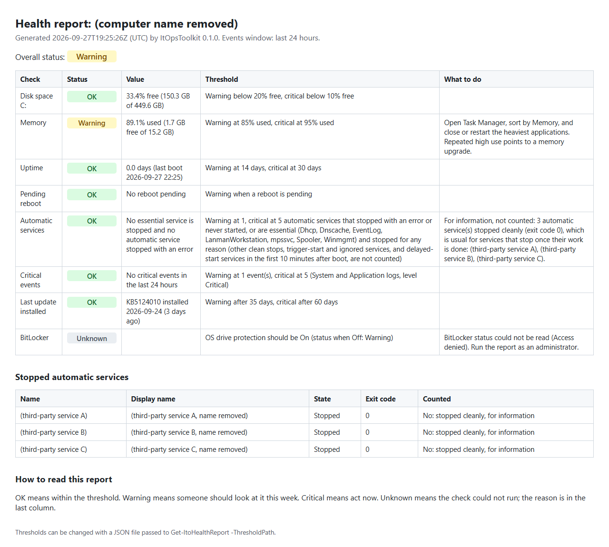
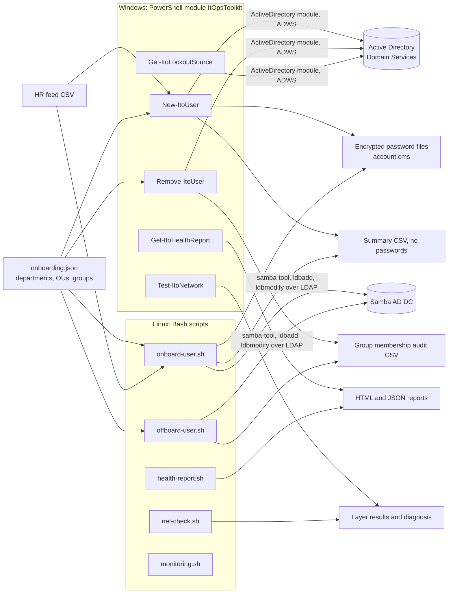

# it-ops-toolkit

Tested help-desk automation for Windows and Linux: Active Directory onboarding, offboarding and
lockout tracing, computer health reports, and layered network troubleshooting, with a knowledge
base to match.

[](https://github.com/fasharif/it-ops-toolkit/actions/workflows/ci.yml)

## Sample output

A health report from `Get-ItoHealthReport` in Windows PowerShell 5.1 on a Windows 11 PC. It ran
without administrator rights, so BitLocker is Unknown, while the PC was busy with container
builds, hence the memory Warning. The computer name and three third-party service names were
removed before publishing. The report itself: [HTML](docs/samples/windows-health-report.html),
[JSON](docs/samples/windows-health-report.json).



A network check on the same PC, ending in a plain-language diagnosis:

```text
PS> Test-ItoNetwork | Select-Object -ExpandProperty Layers

Layer            Status Detail
-----            ------ ------
IP configuration Pass   Wi-Fi: 192.168.50.112
Default gateway  Pass   192.168.50.1 answers ping (2 ms).
DNS servers      Pass   DNS servers: 1.1.1.1, 1.0.0.1.
DNS resolution   Pass   www.microsoft.com resolves to 23.35.101.225.
TCP port         Pass   Connected to 23.35.101.225 on port 443.
HTTPS            Pass   TLS handshake completed; the server answered with HTTP status 200.
Route trace      Info   Reached 23.35.101.225 in 12 hop(s).

PS> (Test-ItoNetwork -ComputerName fileserver.corp.itops.test -Port 445 -SkipTrace).Diagnosis
DNS works, but the name 'fileserver.corp.itops.test' does not resolve. Check the spelling. For an internal name, check that the record exists and that you are on the office network or VPN (split DNS).
```

Onboarding the example HR feed ([examples/new-starters.csv](examples/new-starters.csv)) into a
real Samba Active Directory domain controller: the throwaway test domain of the integration
tests, in Docker. Two people called Sara Ali get different account names, accents and
apostrophes are handled, and each initial password goes only into an encrypted file:

```text
$ linux/onboard-user.sh --csv examples/new-starters.csv --config config/onboarding.example.json --deliver-dir /srv/it-ops/deliver --deliver-cert /srv/it-ops/delivery.pem
Row  Account               Status   Message
1    sara.ali              Created  Created sara.ali@corp.itops.test in OU=Finance,OU=Staff,DC=corp,DC=itops,DC=test.
2    sara.ali2             Created  Created sara.ali2@corp.itops.test in OU=Sales,OU=Staff,DC=corp,DC=itops,DC=test.
3    jose.garcialopez      Created  Created jose.garcialopez@corp.itops.test in OU=IT,OU=Staff,DC=corp,DC=itops,DC=test.
4    liam.obrien           Created  Created liam.obrien@corp.itops.test in OU=Human Resources,OU=Staff,DC=corp,DC=itops,DC=test.
5    aisha.almansoori      Created  Created aisha.almansoori@corp.itops.test in OU=Finance,OU=Staff,DC=corp,DC=itops,DC=test.

Onboarding summary: 5 created.
```

More real output is in [docs/samples](docs/samples/README.md), which says where each file ran:
offboarding against the Samba test domain, `Test-ItoNetwork` in PowerShell 7.6 on Linux, and the
Linux health report and Born2beRoot summary (from the Debian test container, not a server).
`scripts/make-samples.sh` regenerates the Linux samples.

## The problem it solves

First- and second-line support spends much of its time on the same few jobs: creating accounts
for new starters, closing them for leavers, finding out why a PC is slow or an account keeps
locking, and working out whether "the internet is down" is the laptop, the Wi-Fi, DNS or the
server. Done by hand, these jobs are slow and inconsistent: accounts land in the wrong OU,
leavers keep group memberships, passwords get pasted into tickets, and network faults are
guessed at instead of isolated.

This toolkit makes those jobs repeatable. The scripts validate their input, preview changes
(`-WhatIf`, `--dry-run`), can be run twice safely, never print or log passwords, and return
structured results that fit into a ticket. The knowledge base and method explain the manual side
of the same tickets.

## Features

**PowerShell module `ItOpsToolkit`** (Windows PowerShell 5.1 and PowerShell 7; comment-based help,
parameter validation and `-WhatIf`/`-Confirm` on everything that changes state). The three Active
Directory functions, `New-ItoUser`, `Remove-ItoUser` and `Get-ItoLockoutSource`, are tested with
Pester mocks only and have not yet run against a Windows Server domain (see
[Limitations](#limitations-and-roadmap)); the Bash versions of onboarding and offboarding run
against a real Samba AD domain controller in the integration tests.

- `New-ItoUser` creates Active Directory accounts from an HR feed CSV: department-to-OU and group
  mapping from JSON, unique `sAMAccountName` generation (first.last or flast, at most 20
  characters, numbered on collision, unique across users, groups and computers, built from an
  optional Latin spelling for names in Arabic or other scripts), a strong random
  initial password delivered only as a CMS-encrypted file (to a certificate file, object or
  thumbprint) or a `SecureString`, "must change password at next logon", and a CSV summary. The
  password is passed to commands only as a `SecureString`, never as plain text, so PowerShell
  module logging records no more than the type name. Rows already onboarded (same employee ID)
  are skipped, with a warning for any configured group the existing account lacks. One domain
  controller is used for the whole run.
- `Remove-ItoUser` offboards a leaver: exports group memberships for audit first, disables the
  account, records the ticket number in the description, removes groups and moves the account to
  the disabled users OU. Each step checks the current state, so a second run changes nothing.
  Groups are never removed without the audit file; answering No at a prompt gives a `Partial`
  result that names what was not done.
- `Get-ItoLockoutSource` shows whether an account is locked out and which computers caused it,
  from event 4740 on the PDC emulator.
- `Get-ItoHealthReport` grades disk space, memory, uptime, pending reboot, stopped automatic
  services, recent critical events, the last update installed and BitLocker status against clear
  thresholds, and writes HTML and JSON. Essential services such as the print spooler and DNS
  client count whenever they are stopped; other services count only when they stopped with an
  error, and clean stops are listed for information.
- `Test-ItoNetwork` checks IP configuration, gateway, DNS servers, DNS resolution, TCP port,
  HTTPS and a route trace, and names the lowest failing layer in plain language.
- `New-ItoRandomPassword` generates passwords from the operating system's cryptographic random
  number generator, without look-alike characters.

**Bash scripts for Linux** (`linux/`):

- `onboard-user.sh` and `offboard-user.sh`: the same onboarding and offboarding against Samba
  Active Directory with `samba-tool` and LDAP, using the same JSON configuration. Accounts are
  created with one atomic `ldbadd`; passwords never appear on a command line.
- `health-report.sh`: disk, memory, uptime, pending reboot, failed systemd units, critical journal
  entries, last package upgrade (from the dpkg logs, rotated ones included) and root filesystem
  encryption, as text, JSON or HTML, with Nagios-style exit codes.
- `net-check.sh`: the layered network check and diagnosis on Linux.
- `monitoring.sh`: the Born2beRoot system summary (architecture and kernel, physical and virtual
  CPUs, memory and disk use, CPU load, last boot, LVM, TCP connections, users, IP and MAC, sudo
  command count), rebuilt from scratch to read `/proc` directly and broadcast with `wall`.

**Documentation:** ten [knowledge base articles](docs/kb/README.md) (lockouts, password and MFA
resets, Wi-Fi, VPN, printers, disk space, slow PCs, Outlook, DNS, new starters) and a
[troubleshooting method](docs/method.md) with an ITIL-style priority matrix and a ticket template.

## Architecture



The PowerShell side and the Bash side are independent implementations of the same rules. They
share the JSON configuration and three fixture files that both test suites run: account-name cases
([tests/fixtures/account-names.csv](tests/fixtures/account-names.csv)), HR feed rows with the
exact problems each must report ([tests/fixtures/feed-rows.csv](tests/fixtures/feed-rows.csv))
and bad configurations ([tests/fixtures/invalid-configs.tsv](tests/fixtures/invalid-configs.tsv)).

## Tech stack and why

| Part | Choice | Why |
| --- | --- | --- |
| Windows automation | PowerShell module, Windows PowerShell 5.1 and PowerShell 7 | What Windows help desks already run; the `ActiveDirectory` module is the supported way to manage AD |
| Linux automation | Bash, `samba-tool`, ldb tools, `jq` | Available on any Samba administration host; no extra runtime |
| CSV parsing on Linux | Python 3 standard library (`linux/lib/hrfeed.py`) | Bash has no reliable CSV parser; Python is already required by `samba-tool` |
| Password delivery | CMS encryption (.NET `EnvelopedCms`, `openssl cms`) | Standard format that `Unprotect-CmsMessage` and `openssl cms` both read; only the certificate holder can decrypt; the password is encrypted through .NET method calls and passed to commands only as a `SecureString`, so module logging cannot record it |
| Network checks | .NET `System.Net` classes | One code path for Windows and Linux, testable without Windows-only cmdlets |
| Tests | Pester 5, bats-core, a Samba AD DC in Docker | Unit tests with mocks and fakes, plus a real directory for the Bash scripts |
| Linting | PSScriptAnalyzer, shellcheck, ruff, mypy `--strict`, actionlint | One linter per language, all clean |

## Quick start

On Windows (PowerShell 5.1 or 7):

```powershell
git clone https://github.com/fasharif/it-ops-toolkit.git; cd it-ops-toolkit
Set-ExecutionPolicy -Scope Process -ExecutionPolicy Bypass
Import-Module .\src\ItOpsToolkit\ItOpsToolkit.psd1
Test-ItoNetwork
Get-ItoHealthReport -OutputDirectory $env:TEMP
```

The second line matters. Windows PowerShell blocks unsigned scripts by default: the default
execution policy on Windows clients is `Restricted`, `RemoteSigned` blocks files it treats as
downloaded, and the module is not signed. `-Scope Process` lifts the block for this PowerShell
window only and changes nothing permanently; it also covers a ZIP download's "downloaded from
the internet" mark. If Group Policy sets the execution policy, ask your administrator.

On Linux, `linux/net-check.sh` and `linux/health-report.sh` need no set-up.

For onboarding on either platform, copy `config/onboarding.example.json` to
`config/onboarding.json`, edit it for your directory, and preview first:

```powershell
New-ItoUser -Path .\examples\new-starters.csv -ConfigPath .\config\onboarding.json -WhatIf -InformationAction Continue
```

```bash
linux/onboard-user.sh --csv examples/new-starters.csv --config config/onboarding.json \
    --url ldap://dc1.corp.example.com --auth-file ~/.config/it-ops/admin.auth --dry-run
```

`-InformationAction Continue` shows the one-line summary at the end, which PowerShell otherwise
hides. Write real summaries, audit files and delivery files outside the repository: they hold
names and employee IDs (`.gitignore` covers the usual names, as a safety net).

Every command has built-in help: `Get-Help New-ItoUser -Full`, `linux/onboard-user.sh --help`.

## Configuration

**Onboarding and offboarding** use one JSON file ([example](config/onboarding.example.json),
[schema](config/onboarding.schema.json)):

| Setting | Meaning |
| --- | --- |
| `upnSuffix` | Suffix for sign-in names and mail addresses, for example `corp.example.com` |
| `samAccountNameFormat` | `first.last` (default) or `flast` |
| `disabledOu` | Distinguished name of the OU that leavers are moved to |
| `defaultGroups` | Groups every new starter joins |
| `departments` | One entry per HR department name (matched without regard to case), each with an `ou` and `groups` |

Setting names, `samAccountNameFormat` and distinguished names are case-sensitive, as in the
schema: write `OU=Finance,DC=corp,DC=example,DC=com`, not `ou=finance,dc=...`. Both toolkits
reject anything else with the same message.

**HR feed columns:** `EmployeeId`, `GivenName`, `Surname`, `Department` (required), `Title`,
`Manager` (the manager's sAMAccountName) and `StartDate` (yyyy-MM-dd) (optional).
`GivenNameLatin` and `SurnameLatin` (optional) give a Latin-script spelling for a name written in
another script, such as Arabic: the account and sign-in names are built from them, and the
display name keeps the original script. A row for سارة الهاشمي with the Latin spelling Sara Al
Hashimi becomes `sara.alhashimi`, displayed as سارة الهاشمي.

**Password delivery certificate.** `New-ItoUser` needs a certificate with the Document Encryption
enhanced key usage. On Windows:

```powershell
$cert = New-SelfSignedCertificate -Subject 'CN=Service Desk Delivery' -Type DocumentEncryptionCert -CertStoreLocation Cert:\CurrentUser\My
Export-Certificate -Cert $cert -FilePath .\servicedesk.cer
```

`-DeliveryCertificate` also takes the certificate's thumbprint, when it is in your personal
certificate store, or an `X509Certificate2` object. The holder of the private key reads a
delivery file with `Unprotect-CmsMessage -Path .\sara.ali.cms`. `onboard-user.sh` takes a PEM
certificate (`--deliver-cert`); the service desk decrypts with
`openssl cms -decrypt -binary -inform PEM -in sara.ali.cms -inkey key.pem -recip cert.pem`.

**Samba credentials** for the Bash scripts are read from a Samba authentication file (lines
`username=`, `password=`, `domain=`), mode 600, given with `--auth-file` or `ITO_AUTH_FILE`. The
domain controller is `--url` or `ITO_LDAP_URL`.

**Health thresholds.** `Get-ItoHealthReport -ThresholdPath` takes a JSON file
([example](config/health-thresholds.example.json)); `health-report.sh` reads environment variables
(`ITO_DISK_FREE_WARN=20`, `ITO_MEMORY_USED_WARN=85` and so on; see `--help`). The defaults match:

| Check | Warning | Critical |
| --- | --- | --- |
| Free disk space | below 20% | below 10% |
| Memory in use | 85% | 95% |
| Uptime | 14 days | 30 days |
| Stopped automatic services that count (see below) / failed units | 1 | 5 |
| Critical events / journal entries (24 h) | 1 | 5 |
| Days since the last update (Linux: the last package upgrade) | 35 | 60 |

A stopped automatic service counts when it stopped with an error or never started, or when it is
on the essential list (`Dhcp`, `Dnscache`, `EventLog`, `LanmanWorkstation`, `mpssvc`, `Spooler`,
`Winmgmt`), whatever its exit code. Other services that stopped cleanly (exit code 0) are listed
for information and not counted, and delayed-start services are not counted in the first 10
minutes after boot. `essentialServices` and `ignoredServices` in the threshold file change the
lists; see [decision 16](docs/decisions.md).

## Running the tests

Everything runs in containers, so Docker is the only requirement.

| Command | What it runs |
| --- | --- |
| `scripts/test-powershell.sh` | PSScriptAnalyzer and the Pester suite in PowerShell 7.6 LTS, in the Ubuntu 24.04 test image (`tests/docker/Dockerfile`, target `powershell`) |
| `scripts/test-bash.sh` | shellcheck, then the bats unit tests in the Debian 13 test image |
| `scripts/lint-python.sh` | ruff and `mypy --strict` for `linux/lib/hrfeed.py` |
| `tests/integration/run.sh` | Starts a Samba AD DC and runs onboarding and offboarding against it, then removes it |
| `powershell -ExecutionPolicy Bypass -File scripts\Invoke-Tests.ps1 -Stage Test -Install` | The Pester suite in Windows PowerShell 5.1 |
| `scripts/make-samples.sh` | Regenerates the Linux samples in `docs/samples` |

`-Install` lets `scripts/Invoke-Tests.ps1` download the pinned Pester and PSScriptAnalyzer from
the PowerShell Gallery, check their SHA-256 hashes and unpack them into `out/modules`. Nothing
is installed into your PowerShell profile. Without `-Install` it uses copies you already have,
or stops and says what is missing. In Windows PowerShell 5.1, keep the clone's path short:
.NET Framework cannot load Pester's DLL from a path longer than 260 characters.

Results of the last full run, on 2026-09-26, from a fresh clone of the branch on a Windows 11
development machine with Docker Desktop (Linux containers). These are pass/fail results only; no
timings are published.

| Check | Environment | Command | Result |
| --- | --- | --- | --- |
| PSScriptAnalyzer 1.25.0 | PowerShell 7.5.0, `mcr.microsoft.com/powershell:7.5-ubuntu-24.04` | `scripts/test-powershell.sh` | No findings |
| Pester 5.9.1 | Same container | `scripts/test-powershell.sh` | 203 passed, 0 failed, 0 skipped; command coverage of `src/ItOpsToolkit` 87.7% (1648 of 1880 commands) |
| Pester 5.9.1 | Windows PowerShell 5.1.26100, Windows 11, .NET Framework 4.8 | `powershell -ExecutionPolicy Bypass -File scripts\Invoke-Tests.ps1 -Stage Test -MinimumCoverage 80`, with the pinned Pester already on `PSModulePath` | 200 passed, 0 failed, 3 skipped (see [decision 9](docs/decisions.md)); command coverage 87.3% (1642 of 1880 commands) |
| shellcheck 0.11.0 | `koalaman/shellcheck:v0.11.0` | `scripts/test-bash.sh` | No findings |
| bats-core 1.14.0 | Debian 13 test image (`tests/docker/Dockerfile`, target `test`) | `scripts/test-bash.sh` | 119 passed, 0 failed |
| ruff 0.16.9, mypy 2.3.1 `--strict` | `python:3.13-slim` | `scripts/lint-python.sh` | No findings |
| Samba AD integration | Samba 4.22.11 (Debian package 4.22.11+dfsg-0+deb13u1) AD DC and a client, Debian 13 containers | `tests/integration/run.sh` | 14 passed, 0 failed |
| actionlint 1.7.12 | `rhysd/actionlint:1.7.12` | `docker run --rm -v "$PWD:/repo" -w /repo rhysd/actionlint:1.7.12` | No findings |

Pester's coverage figure counts commands (breakpoints), not lines.

CI (`.github/workflows/ci.yml`) runs the same commands on every push to `main` and every pull
request, plus the Pester suite on a Windows runner under Windows PowerShell 5.1 and PowerShell 7,
and actionlint. It has not run yet (see below); the PowerShell 7 on Windows step is the one
combination with no local result.

## Folder structure

```text
.
├── config/                     onboarding.example.json, its JSON schema, health threshold example
├── docs/
│   ├── kb/                     ten help-desk articles
│   ├── samples/                real output from the tools, and where each file ran
│   ├── decisions.md            design decisions
│   └── method.md               troubleshooting method, priority matrix, ticket template
├── examples/new-starters.csv   example HR feed
├── linux/                      onboard-user.sh, offboard-user.sh, health-report.sh, net-check.sh, monitoring.sh
│   └── lib/                    shared Bash libraries, config-check.jq, hrfeed.py
├── scripts/                    test runners (PowerShell, Bash, Python) and make-samples.sh
├── src/ItOpsToolkit/           the PowerShell module (Public/ and Private/ functions)
└── tests/
    ├── bats/                   bats unit tests and fake Samba tools
    ├── docker/Dockerfile       test images: tools, test (bats), dc (Samba AD), powershell (Pester)
    ├── fixtures/               account-name, feed-row and bad-configuration cases shared by Pester and bats
    ├── integration/            Samba AD integration tests (compose.yaml, run.sh)
    └── powershell/             Pester tests and ActiveDirectory stubs
```

## Design decisions

The main choices, with their reasons and trade-offs, are in [docs/decisions.md](docs/decisions.md).
In short: one configuration for both platforms, with the same case-sensitive rules; Pester mocks
for the AD module (Samba has no ADWS) and a real Samba DC for the Bash scripts; passwords only
ever leave the tools encrypted, and are passed to commands only as a `SecureString`; Samba
accounts created in one atomic `ldbadd`; .NET networking, so `Test-ItoNetwork` has one code path
for both editions and operating systems; idempotent onboarding and offboarding; one domain
controller per run; accounts created enabled before the start date, with the trade-off
explained; Windows PowerShell 5.1 compatibility tested rather than assumed.

## Limitations and roadmap

**Not run yet, and how to run it:**

- **`New-ItoUser`, `Remove-ItoUser` and `Get-ItoLockoutSource` against a real Windows Server
  domain.** They are tested only with Pester mocks: the `ActiveDirectory` module needs Active
  Directory Web Services, which the Samba test DC does not provide. To run them, use a test
  domain with RSAT installed on a domain-joined machine: create the OUs and groups from
  `config/onboarding.example.json`, create a delivery certificate as shown above, then run
  `New-ItoUser -WhatIf`, `New-ItoUser`, `Remove-ItoUser -WhatIf` and `Remove-ItoUser`, and check
  the results in Active Directory Users and Computers. `Get-ItoLockoutSource` also needs Event
  Log Readers rights on the domain controllers.
- **The GitHub Actions workflow.** It passes actionlint and its Linux jobs run the same scripts
  that were run locally, but it has not run on GitHub yet because the repository has not been
  pushed. One combination has not run anywhere: the Pester suite under PowerShell 7 on Windows
  (the second step of the `powershell-windows` job), because this machine has no PowerShell 7.
  It runs on the first push.
- **PowerShell module logging.** The tests show that the initial password never passes through
  a command parameter as plain text (only as a `SecureString`, which logging shows as its type
  name), using a `ParameterBinding` trace, which sees the same values as module logging
  (event 4103). Module logging itself was not switched on, because that is a system
  policy change. To check it: on a test machine, enable module logging for all modules
  (Group Policy: Windows Components > Windows PowerShell > Turn on Module Logging, module name
  `*`), run `New-ItoUser` with `-DeliveryPath`, decrypt the delivery file, and search the
  Microsoft-Windows-PowerShell/Operational log for the password.
- **Linux checks that need systemd, LVM or LUKS.** In a container there is no systemd, so
  `health-report.sh` reports failed units, the journal and disk encryption as Unknown, and
  `monitoring.sh` shows no LVM. Those paths are covered by bats tests with fake commands. To run
  them for real, run the scripts on a systemd-based VM (for example a Born2beRoot Debian VM with
  LVM on LUKS) as root.
- **The BitLocker check as an administrator.** The Windows sample above ran unelevated, so
  BitLocker shows Unknown ("Access denied"). Run `Get-ItoHealthReport` from an elevated prompt
  to see the protection status (Windows Home has the BitLocker module too, for Device
  Encryption).

**Limitations:**

- `Get-ItoHealthReport` checks the computer it runs on; for a remote PC, run it there (for
  example with `Invoke-Command`).
- The route trace is IPv4 only. Inside Docker Desktop, the trace is not meaningful, because
  Docker's network layer answers ICMP itself.
- The Bash directory scripts authenticate with an authentication file; Kerberos ticket use is
  not implemented.
- New accounts are enabled from the moment they are created, usually days before the start
  date; see [decision 13](docs/decisions.md) for why, and how to keep them disabled until then.
- A rerun of a feed warns about configured groups an existing account lacks, but does not add
  them.
- The Samba test DC stores ACLs in a TDB file so it can run unprivileged; it is a test fixture,
  not a production build.

**Roadmap:** run the AD functions in a Windows Server 2025 evaluation lab domain (a DC and a
domain-joined client) and record the transcripts; add a `-Disabled` option that creates accounts
switched off until the start date; add Kerberos authentication to the Bash scripts; move to
Pester 6; publish the module to the PowerShell Gallery.

## A note for IT support roles

For IT support and service desk roles, a certification such as CompTIA A+ or Microsoft MD-102
(Endpoint Administrator) matters as much as this repository. The repository shows practical,
tested work; it does not replace the structured coverage of hardware, operating systems and
endpoint management that those certifications examine.

## Licence

[MIT](LICENSE). Copyright (c) 2026 Farah Sharif.
