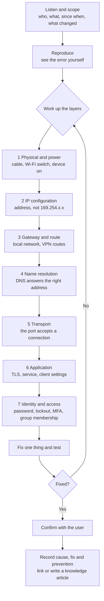

# Troubleshooting method, priorities and tickets

How the scripts and the knowledge base in this repository are meant to be used on a service desk.

## 1. A layered troubleshooting method

Most wasted time in support comes from guessing at the top of the stack (reinstalling an
application) when the fault is at the bottom (no IP address). Work up from the bottom, change
one thing at a time, and write down what each step showed.



1. **Listen and scope.** Who is affected (one user, a team, everyone)? What exactly fails, with
   the exact error text? Since when? What changed (update, password change, new location, new
   device)? The scope decides the priority (section 2) and often the cause.
2. **Reproduce.** See the error yourself, or ask for a screenshot with the time. An error you
   cannot see is a guess.
3. **Work up the layers.** Start at the bottom. `Test-ItoNetwork` and `net-check.sh` do layers
   2 to 6 in one run and name the lowest one that failed; `Get-ItoHealthReport` and
   `health-report.sh` cover the device itself; `Get-ItoLockoutSource` covers the lockout part of
   layer 7.
4. **Change one thing at a time,** least disruptive first, and test after each change. If a
   change does not help, undo it before the next one.
5. **Confirm with the user** that the original problem is gone, not just that a test passes.
6. **Record** the cause, the fix and how to prevent it. If the same fault can happen again,
   update or write a knowledge article.

Escalate when the fix needs access or authority you do not have, when more than one user is
affected and the cause is not on the device, or when there is any sign of a security incident.
Escalate with evidence: the layer results, times and error text, not "it doesn't work".

## 2. Priority matrix (impact x urgency)

Priority follows the ITIL approach: it combines **impact** (how much of the business is
affected) with **urgency** (how quickly the business needs it fixed). A senior person's ticket
is not automatically high priority; the effect on the business is what counts.

**Impact**

- **High:** a whole site or department, or a business-critical service (payments, payroll,
  customer-facing systems).
- **Medium:** a team, or several users.
- **Low:** one user, or a non-critical service.

Impact is about how many people and which services are affected, not about deadlines: a
deadline makes a ticket urgent, which is the other axis.

**Urgency**

- **High:** work has stopped and there is no workaround, or a deadline is today.
- **Medium:** work is degraded, or a workaround exists but is costly.
- **Low:** inconvenience; a workaround exists, or the need is weeks away.

|                    | Urgency high | Urgency medium | Urgency low |
| ------------------ | ------------ | -------------- | ----------- |
| **Impact high**    | P1 Critical  | P2 High        | P3 Medium   |
| **Impact medium**  | P2 High      | P3 Medium      | P4 Low      |
| **Impact low**     | P3 Medium    | P4 Low         | P5 Planning |

Example response and resolution targets, to agree with the business in a service level
agreement. These are illustrative targets, not measurements:

| Priority | Respond within | Resolve within | Examples |
| --- | --- | --- | --- |
| P1 Critical | 15 minutes | 4 hours | The VPN is down for all remote staff; payroll cannot run on payday |
| P2 High | 30 minutes | 8 hours | A department's shared drive is unavailable; a new starter cannot sign in on day one |
| P3 Medium | 4 business hours | 3 business days | One user's Outlook will not load, with Outlook on the web as a workaround |
| P4 Low | 1 business day | 5 business days | A printer driver prompt for one user |
| P5 Planning | 2 business days | Planned change | Request for a second monitor next month |

Raise the priority when the situation changes (more users affected, the workaround stops
working), and record why.

## 3. Ticket template

```text
Summary:            <one line: what fails, for whom>
Reported by:        <name, contact, how verified>        Reported at: <date and time>
Affected:           <users, devices, service>             Location: <office / home / site>
Impact / Urgency:   <high|medium|low> / <high|medium|low>  Priority: <P1-P5>
Category:           <account | network | hardware | software | email | printing | access>

Description:        <what the user sees, exact error text, since when>
What changed:       <recent updates, password change, new device or location; "nothing known">
Steps to reproduce: <numbered steps>

Troubleshooting (layer by layer, with results):
  1. ...
  2. ...

Workaround:         <what the user can do meanwhile, or "none">
Resolution:         <what fixed it>
Root cause:         <why it happened>
Verified with user: <who, when>
Prevention:         <what stops it happening again>
Knowledge article:  <link, or "new article needed">
Time spent:         <minutes>
```

## 4. Worked example

The ticket below is a worked example with fictional names. The `Test-ItoNetwork` output is from
a real run of the tool against a name that does not exist in public DNS, which is what a remote
user's laptop sees when an internal name is looked up without the VPN's DNS settings (see
[docs/samples/test-itonetwork-windows.txt](samples/test-itonetwork-windows.txt)).

```text
Summary:            Remote user cannot open the finance share
Reported by:        Sara Ali, Finance, ext. 4127 (called back on the number in the directory)
Reported at:        2026-09-28 09:12
Affected:           1 user, laptop PC-0142          Location: home
Impact / Urgency:   low / high (one user; month-end close today, no workaround)   Priority: P3
Category:           network

Description:        \\fileserver.corp.itops.test\finance shows "Windows can't find
                    \\fileserver.corp.itops.test". Outlook and Teams work. Started this morning.
What changed:       Worked from home today; in the office yesterday. Password unchanged.
Steps to reproduce: 1. Connect to home Wi-Fi. 2. Open File Explorer. 3. Open the finance share.

Troubleshooting (layer by layer, with results):
  1. Get-ItoHealthReport: overall OK (disk, memory, services, updates). Device not the cause.
  2. Test-ItoNetwork (internet): IP, gateway, DNS, TCP 443 and HTTPS all pass.
  3. Test-ItoNetwork -ComputerName fileserver.corp.itops.test -Port 445 -SkipTrace:
       DNS works, but the name 'fileserver.corp.itops.test' does not resolve. Check the
       spelling. For an internal name, check that the record exists and that you are on the
       office network or VPN (split DNS).
  4. The VPN client was not connected: it had failed to start after an update overnight.

Workaround:         none needed
Resolution:         Restarted the VPN client service and connected. Test-ItoNetwork now resolves
                    the file server and connects on port 445; the share opens.
Root cause:         VPN client did not start after an update, so internal names were not
                    resolvable from home.
Verified with user: Sara Ali, 09:31, opened and saved a file on the share.
Prevention:         Reported the start-up failure to the endpoint team (problem ticket raised).
Knowledge article:  docs/kb/04-vpn-fails.md, docs/kb/09-dns-resolution-failures.md
Time spent:         19 minutes
```

Why P3: one user is affected, so the impact is low; month-end close is today and there is no
workaround, so the urgency is high. Low impact and high urgency give P3 in the matrix. Had the
whole finance team been unable to reach the share, the impact would have been medium and the
ticket P2.
